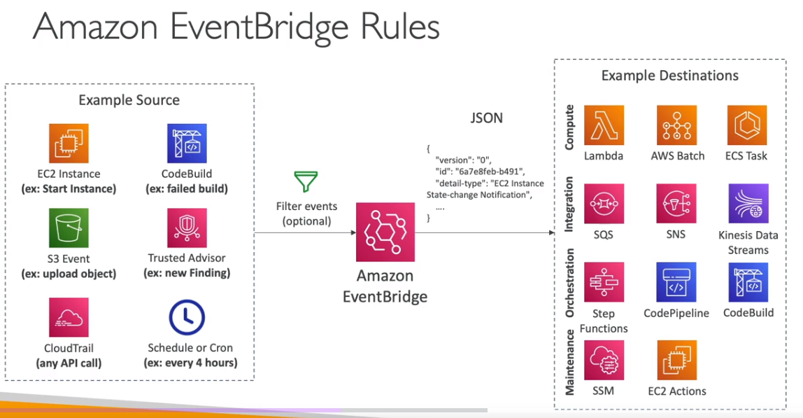

# Summary of concepts for AWS SysOps Administrator Certification.

## CloudWatch

### AWS CloudWatch Metrics
CloudWatch provides ``metrics for every services in AWS``

- `Metric` is a variable to monitor (CPUUtilization, NetworkIn...)
- Metrics belong to `namespaces`
- Dimension is an attribute of a metric (instance id, environment, etc...).
- Up to 30 dimensions per metric
- Metrics have `timestamps`
- Can create CloudWatch dashboards of metrics

AWS Provided metrics (AWS pushes them):
1. ``Basic`` Monitoring (default): metrics are collected at a `5 minute` internal
1. ``Detailed`` Monitoring (paid): metrics are collected at a `1 minute` interval
1. Includes `CPU, Network, Disk and Status Check Metrics`

Custom metric (__yours to push__):
1. Basic Resolution: 1 minute resolution
1. High Resolution: all the way to 1 second resolution
1. Include `RAM`, application level metrics
1. Make sure the IAM permissions on the EC2 instance role are correct !

<u>**RAM is NOT included in the AWS EC2 metrics**</u>

#### CloudWatch Custom Metrics
You can retrieve custom metrics from your applications or services using the `StatsD` and `collectd` protocols. StatsD is supported on both Linux servers and servers running Windows Server. collectd is supported only on Linux

- Possibility to define and send your own custom metrics to CloudWatch
- Example: memory (RAM) usage, disk space, number of logged in users ...
- Use API call ``PutMetricData``
- Ability to use dimensions (attributes) to segment metrics
  - Instance.id
  - Environment.name
- Metric resolution (``StorageResolution`` API parameter – two possible value):
  - Standard: 1 minute (60 seconds)
  - High Resolution: 1/5/10/30 second(s) – Higher cost
 - Important `👀 Exam`: **``Accepts metric data points two weeks in the past and two hours in the future (make sure to configure your EC2 instance time correctly)``**

 - You can `use AWS CLI or API` to `upload` the `data metrics` to CloudWatch.

```bash
 aws cloudwatch put-metric-data --metric-name PageViewCount --namespace MyService --value 2 --timestamp 2023-01-01-14T08:00:00.000Z
 ```

 ### CloudWatch Dashboards
- Great way to setup custom dashboards for quick access to key metrics and alarms
- **``Dashboards are global``**
- **``Dashboards can include graphs from different AWS accounts and regions**``** `👀 Exam`
- You can change the time zone & time range of the dashboards
- You can setup automatic refresh (10s, 1m, 2m, 5m, 15m)
- Dashboards can be shared with people who don’t have an AWS account (public, email address, 3rd party SSO provider through Amazon Cognito)

CloudWatch Logs - Sources
- SDK, CloudWatch Logs Agent, CloudWatch Unified Agent
- Elastic Beanstalk: collection of logs from application
- ECS: collection from containers
- AWS Lambda: collection from function logs
- VPC Flow Logs: VPC specific logs
- API Gateway
- CloudTrail based on filter
- Route53: Log DNS queries

### CloudWatch Logs Subscriptions
- **``Get a real-time log events from CloudWatch Logs for processing and analysis``**
- Send to Kinesis Data Streams, Kinesis Data Firehose, or Lambda
- ``Subscription Filter ``– filter which logs are events delivered to your destination

- ``Cross-Account Subscription`` – send log events to resources in a different AWS account (KDS, KDF)

### Alarms
CloudWatch alarms allow you to monitor metrics and trigger actions based on defined thresholds. In this case, you can create a CloudWatch alarm that monitors the CPU utilization metric of the EC2 instance. When the CPU utilization reaches 100%, the alarm will be triggered, and you can configure actions such as sending notifications or executing automated actions to address the unresponsiveness issue.

### Alarm Targets:
- ``EC2`` - Stop, Terminate, Reboot, or Recover an EC2 Instance
- ``EC2 Auto Scaling`` - Trigger Auto Scaling Action, scaling up or down.
- ``SNS`` - Send notification to SNS (from which you can do pretty much anything)

- ``Composite Alarms are monitoring the states of multiple other alarms``

### EC2 Instance Recovery
StatusCheckFailed_System
- Status Check:
  - `Instance status = check the EC2 VM`
  - `System status = check the underlying hardware`

- ``Recovery: Same Private, Public, Elastic IP, metadata, placement group``

      👀 Alarms can be created based on CloudWatch Logs Metrics Filters

- Test an alarm using `aws set-alarm-state`

```bash
👀 aws cloudwatch set-alarm-state --alarm-name "TerminateInHighCPU" --state-value ALARM --state-reason "testing purposes"
```

### CloudWatch Synthetics
CloudWatch Synthetics canaries are `automated/configurable scripts` that `monitor` the `availability and performance of applications, endpoints, and APIs`. They are `designed to simulate user interactions with an application and provide insights into its behavior`.

Canaries are created using scripts written in Node.js or Python and are scheduled to run at regular intervals. These scripts perform tasks such as navigating through a website, clicking on specific elements, submitting forms, and validating responses. By executing these predefined actions, canaries can monitor the functionality, responsiveness, and performance of an application or API.

CloudWatch Synthetics canaries collect data on metrics like response time, latency, availability, and success rates. They can also be configured to generate alarms when certain conditions are met, allowing proactive identification and remediation of issues.

#### Reference
[https://docs.aws.amazon.com/awssupport/latest/user/trusted-advisor-check-reference.html](https://docs.aws.amazon.com/awssupport/latest/user/trusted-advisor-check-reference.html)

### Amazon EventBridge (formerly CloudWatch Events)
- Schedule: Cron jobs (scheduled scripts) - Schedule Every hour ->  Trigger script on Lambda function
- Event Pattern: Event rules to react to a service doing something - IAM Root User Sign in Event ->  SNS Topic with Email Notification
- Trigger Lambda functions, send SQS/SNS messages...



### Service Quotas CloudWatch Alarms
- Notify you when you’re close to a service quota value threshold
- Create CloudWatch Alarms on the Service Quotas console
- Example: Lambda concurrent executions
- Helps you know if you need to request a quota increase or shutdown resources before limit is reached

### Alternative: Trusted Advisor CW Alarms
- Limited number of Service Limits checks in Trusted Advisor (~50)
- Trusted Advisor publishes its check results to CloudWatch

### `👀` For each production EC2 instance, create an `Amazon CloudWatch alarm` for Status `Check Failed: System`. Set the alarm action to `recover the EC2 instance`. Configure the alarm notification to be published to an Amazon Simple Notification Service (Amazon SNS) topic.

``Explanation``: By creating a `CloudWatch alarm` for Status `Check Failed: System`, you can` automate the recovery task of EC2 instances` (`stop, terminate,
reboot, or recover your Amazon EC2 instances`). When the system health check fails for an EC2 instance, the alarm will be triggered and perform the configured action to recover the instance. This eliminates the need for manual intervention. Additionally, configuring the alarm to publish notifications to an SNS topic allows you to receive notifications whenever a system health check fails.

### Status Check
Automated checks to identify `hardware` and `software issues`.

System Status Checks
* Monitors problems with AWS systems (software/hardware issues on the physical host, loss of system power, ...)
* Check ``Personal Health Dashboard`` for any scheduled critical maintenance by AWS to your instance’s host
* Resolution: stop and start the instance (instance migrated to a new host)
  * Either wait for AWS to fix the host, OR
  * Move the EC2 instance to a new host = STOP & START the instance (if EBS backed)
Instance Status Checks
* Monitors software/network configuration of your instance (invalid network configuration, exhausted memory, ...)
* Resolution: reboot the instance or change instance configuration.

#### Status Checks - CW Metrics & Recovery - OJO `👀`
- CloudWatch Metrics (1 minute interval)
  * ``StatusCheckFailed_System``
  * ``StatusCheckFailed_Instance``
  * ``StatusCheckFailed`` (for both)
- Option 1: `CloudWatch Alarm`
  * Recover EC2 instance with the same private/public IP, EIP, metadata, and Placement Group
  * Send notifications using SNS  trigger
- Option 2: `Auto Scaling Group`
  * Set min/max/desired 1 to recover an instance but `won't keep the same private and elastic IP`.`

#### Determine which instance use the most bandwidth
``NetworkIn`` ``and NetworkOut``

#### Identify the processing power required
`👀` ``CPUUtilization`` specifies the percentage of allocated EC2 compute units that are currently in use on the instance. This metric identifies the `processing power required` to `run` an `application on a selected instance`. This metric is expressed in Percent.

#### Number of users.
`👀` ``ActiveConnectionCount`` This metric `represents` the `total number of concurrent TCP connections active` from clients to the load balancer and from the load balancer to targets.

#### RAMUtilization is `NOT available as` an `EC2 metric`
``RAMUtilization`` You can publish your own metrics to CloudWatch using the AWS CLI or an API. You can view statistical graphs of your published metrics with the AWS Management Console. Metrics produced by AWS services are standard resolution by default.

#### 5xx server errors
To monitor the number of 500 Internal Error responses that you're getting, you can enable Amazon CloudWatch metrics. Amazon S3 CloudWatch request metrics include a metric for 5xx server errors.

#### `*Q` 4xxx
You can set an alarm to notify operators when the 404 filter metric exceeds a threshold.

#### Events
You can run `CloudWatch Events` rules according to a `schedule`.

#### EBS Snapshots
It is possible to `create an automated snapshot of an existing Amazon Elastic Block Store (Amazon EBS)` volume on a schedule. You can choose a fixed rate to create a snapshot every few minutes or use a cron expression to specify that the snapshot is made at a specific time of day.

Snapshots are incremental backups, which means that only the blocks on the device that have changed after your most recent snapshot are saved. This minimizes the time required to create the snapshot and saves on storage costs by not duplicating data. Each snapshot contains all of the information that is needed to restore your data (from the moment when the snapshot was taken) to a new EBS volume.

Reference: [Schedule Automated Amazon EBS Snapshots Using CloudWatch Events](https://docs.aws.amazon.com/AmazonCloudWatch/latest/events/TakeScheduledSnapshot.html)

### *Q [Filters](https://docs.aws.amazon.com/AmazonCloudWatch/latest/logs/MonitoringLogData.html)
You can create a `count` of `404` errors `and exclude` other `4xx` errors with a filter pattern on 404 errors.

### Agents
If your AMI contains a CloudWatch agent, it’s automatically installed on EC2 instances when you create an EC2 Auto Scaling group. With the stock Amazon Linux AMI, you need to install it (AWS recommends to install via yum).

#### Install Agents to track the state of each of the instances
You must attach the ``CloudWatchAgentServerRole`` IAM role to the EC2 instance to be able to run the CloudWatch agent on the instance. This role enables the CloudWatch agent to perform actions on the instance.

### Publish custom metrics to CloudWatch.
You can publish your own metrics to CloudWatch using the AWS CLI or an API. You can view statistical graphs of your published metrics with the AWS Management Console. CloudWatch stores data about a metric as a series of data points. Each data point has an associated time stamp. You can even publish an aggregated set of data points called a statistic set.

The `put-metric-data` ``command`` publishes metric data to Amazon CloudWatch, which associates it with the specified metric. If the specified metric does not exist, CloudWatch creates the metric which can take up to fifteen minutes for the metric to appear in calls to `ListMetrics`.

### Collect process metrics with the ``procstat`` plugin
The [procstat](https://docs.aws.amazon.com/AmazonCloudWatch/latest/monitoring/CloudWatch-Agent-procstat-process-metrics.html) plugin enables you to `collect metrics from individual processes`. It is supported on Linux servers and on servers running Windows Server 2012 or later.

---

## CloudTrail
``Provides governance, compliance and audit for your AWS Account``

- CloudTrail is `enabled by default`!
- Get `an history of events / API calls made within your AWS Account` by:
  - Console
  - SDK
  - CLI
  - AWS Services
- Can put logs from CloudTrail into CloudWatch Logs or S3
- ``A trail can be applied to All Regions (default) or a single Region``
- If a resource is deleted in AWS, investigate CloudTrail first!

### CloudTrail Insights
- 👀 Enable `CloudTrail Insights to detect unusual activity` in your account:
  - inaccurate resource provisioning
  - hitting service limits
  - Bursts of AWS IAM actions
  - Gaps in periodic maintenance activity
- CloudTrail Insights analyzes normal management events to create a baseline
- And then `continuously analyzes write events to detect unusual patterns`.
  - Anomalies appear in the CloudTrail console
  - Event is sent to Amazon S3
  - An EventBridge event is generated (for automation needs)

### CloudTrail – Integration with EventBridge
- Used to react to any API call being made in your account
- CloudTrail is not “real-time”:
  - Delivers an event within 15 minutes of an API call
  - Delivers log files to an S3 bucket every 5 minutes

### CloudTrail – Organizations Trails
- A trail that will log all events for all AWS accounts in an AWS Organization
- Log events for management and member accounts
- Trail with the same name will be created in every AWS account (IAM permissions)
- Member accounts can’t remove or modify the organization trail (view only)

### CloudTrail - Log File Integrity Validation
**``Digest Files``**:
  - References the log files for the last hour and contains a hash of each
  - Stored in the same S3 bucket as log files (different folder)
- ``Helps you determine whether a log file was modified/deleted after CloudTrail delivered it``
- ``Hashing using SHA-256, Digital Signing using SHA- 256 with RSĂ``
- `Protect the S3 bucket using bucket policy, versioning, MFA Delete protection, encryption, object lock`
- Protect files using IAM

  ### Q. To ensure that SysOps administrators can easily verify that the CloudTrail log files have not been deleted or changed, the following action should be taken:
  Enable `CloudTrail log file integrity validation` when the trail is created or updated.

  ``Explanation``: Enabling `CloudTrail log file integrity validation` ensures that the log files are protected against tampering or unauthorized modification. CloudTrail uses SHA-256 hashes to validate the integrity of the log files stored in Amazon S3. By enabling this feature, the SysOps administrators can easily verify the integrity of the log files and ensure that they have not been deleted or changed

### Cloud Trail - Integration with EventBridge AWS CloudTrail
* Used to react to any API call being made in your account
* Cloud Trail is not "real-time":
  - Delivers an event within 15 minutes of an API call
  - Delivers log files to an S3 bucket every 5 minutes

### CloudTrail – Organizations Trails
- A trail that will log all events for all AWS accounts in an AWS Organization
- Log events for management and member accounts
- Trail with the same name will be created in every AWS account (IAM permissions)
- `Member accounts can’t remove or modify the organization trail (view only)`

---

## `👀 *Q` AWS Config
- Helps with ``auditing`` and recording **``compliance``** of your AWS resources.
- Helps `record configurations` and changes over time.
Questions that can be solved by AWS Config:
  - Is there **unrestricted SSH** access to my security groups?
  - Do my **buckets have any public access**?
  - How has my **ALB configuration changed over time**?
- You can `receive alerts` (SNS notifications) for any changes
- AWS Config is a `per-region service`.
- Can be aggregated across regions and accounts.
- Possibility of storing the configuration data into S3 (analyzed by Athena)


AWS Config `keeps track of` the `configuration` of `your AWS resources and their relationships to other resources`. It can also `evaluate` those AWS resources for <u>**`compliance`**</u>. This service uses rules that can be configured to evaluate AWS resources against desired configurations.

For example,
- can track `changes` to _`CloudFormation stacks`_.

AWS Config can track changes to CloudFormation stacks. A CloudFormation stack is a collection of AWS resources that you can manage as a single unit. With AWS Config, you can review the historical configuration of your CloudFormation stacks and review all changes that occurred to them.

For more information about how AWS Config can track changes to CloudFormation deployments, see `cloudformation-stack-drift-detection-check`.

- there are AWS Config `rules` that `check` whether or not your _`Amazon S3 buckets have logging enabled`_ or your `IAM users have an MFA device enabled`.

👀 AWS Config is a service that `enables` you to `assess`, `audit`, and `evaluate` the `configurations` of your `AWS resources`. It provides detailed `inventory` and `configuration` history of your resources, as well as configuration change notifications. With AWS Config, you can track the configuration of your S3 bucket, including its bucket policy.

AWS Config rules use AWS Lambda functions to perform the compliance evaluations, and the Lambda functions return the compliance status of the evaluated resources as compliant or noncompliant. The non-compliant resources are remediated using the remediation action associated with the AWS Config rule. With the Auto-Remediation feature of AWS Config rules, the remediation action can be executed automatically when a resource is found non-compliant.

`AWS Config Auto Remediation feature` has auto remediate feature for any non-compliant S3 buckets using the following AWS Config rules:
s3-bucket-logging-enabled s3-bucket-server-side-encryption-enabled s3-bucket-public-read-prohibited s3-bucket-public-write-prohibited
These AWS Config rules act as controls to prevent any non-compliant S3 activities.

### Config Rules
AWS Config provides a number of AWS managed rules that address a wide range of security concerns such as checking if you `encrypted` your Amazon Elastic Block Store (Amazon EBS) volumes, tagged your resources appropriately, and enabled multi-factor authentication (MFA) for root accounts.

- Can use AWS `managed` config `rules` (over 75)
- Can make **``custom config rules (must be defined in AWS Lambda)``**.
  - Ex: evaluate if each EBS disk is of type gp2
  - Ex: evaluate if each EC2 instance is t2.micro
- Rules can be evaluated / triggered:
  - For each config change
  - And / or: at regular time intervals
- **``AWS Config Rules does not prevent actions from happening (no deny)``**.

Managed rules:
- `require-tags`: managed rule in AWS Config. This rule checks if a resource contains the tags that you specify.


### Config Rules – Remediations
Has auto remediate feature for any non-compliant S3 buckets using the following AWS Config rules:

s3-bucket-logging-enabled s3-bucket-server-side-encryption-enabled s3-bucket-public-read-prohibited s3-bucket-public-write-prohibited

These AWS Config rules act as controls to prevent any non-compliant S3 activities.

- `Automate remediation of non-compliant resources using SSM Automation Documents`.
- Use AWS-Managed Automation Documents or create custom Automation Documents
  - `Tip: you can create custom Automation Documents that invokes Lambda function`.
- You can set `Remediation Retries` if the resource is still non-compliant after autoremediation.

### AWS Config Auto Remediation

### Config Rules – Notifications
 - Use EventBridge to trigger notifications when AWS resources are noncompliant
 - Ability to send configuration changes and compliance state notifications to SNS (all events – use SNS Filtering or filter at client-side)

### AWS Config – Aggregators
- The aggregator is created `in one central aggregator account`.
- Aggregates `rules, resources, etc... across multiple accounts & regions`.
- If using `AWS Organizations`, no need for individual Authorization
- Rules are created in each individual source AWS account
- Can `deploy rules` to multiple target accounts using `CloudFormation StackSets`

## CloudWatch vs CloudTrail vs Config
- CloudWatch
  - Performance monitoring (metrics, CPU, network, etc...) & dashboards
  - Events & Alerting
  - Log Aggregation & Analysis
- CloudTrail
  - Record API calls made within your Account by everyone
  - Can define trails for specific resources
  - Global Service
- Config
  - Record configuration changes
  - Evaluate resources against compliance rules
  - Get timeline of changes and compliance

---

## `*Q` [AWS Artifact](https://docs.aws.amazon.com/artifact/latest/ug/what-is-aws-artifact.html)
AWS Artifact `keeps compliance-related reports and agreements`.


`👀`


---
## RDS

### Advantage over using RDS versus deploying
- RDS is a managed service:
  - Automated provisioning, OS patching
  - Continuous backups and restore to specific timestamp (Point in Time Restore)!
  - Monitoring dashboards
  - Read replicas for improved read performance
  - Multi AZ setup for DR (Disaster Recovery)
  - Maintenance windows for upgrades
  - Scaling capability (vertical and horizontal)
  - Storage backed by EBS (gp2 or io1)
- BUT you can’t SSH into your instances

### RDS Read Replicas for read scalability
- Up to 15 Read Replicas
- Within `AZ, Cross AZ or Cross Region`.
- Replication is `ASYNC`.
- Replicas can be promoted to their own DB.

### RDS Read Replicas – Network Cost
- In AWS there’s a network cost when data goes from one AZ to another
- `For RDS Read Replicas within the same region, you don’t pay that fee`.

### RDS Multi AZ (Disaster Recovery)
- `SYNC` replication.
- One DNS name – automatic app failover to standby
- Increase `availability`.
- Failover in case of loss of AZ, loss of network, instance or storage failure

`👀 Exam` - `The Read Replicas be setup as Multi AZ for Disaster Recovery (DR)`.

### Lambda in VPC
- You must define the VPC ID, the Subnets and the Security Groups
- Lambda will create an ENI (Elastic Network Interface) in your subnets
- ``AWSLambdaVPCAccessExecutionRole``

### RDS Proxy for AWS Lambda
- When using Lambda functions with RDS, it opens and maintains a database connection
- This can result in a ``“TooManyConnections”`` exception
- With `RDS Proxy`, you no longer need code that handles cleaning up idle connections and managing connection pools

### DB Parameter Groups
- You can configure the DB engine using Parameter Groups
- Dynamic parameters are applied immediately
- Static parameters are applied after instance reboot
- You can modify parameter group associated with a DB (must reboot)

- *`Must-know parameter`*:
  - PostgreSQL / SQL Server: `rds.force_ssl=1` => force SSL connections
  - MySQL / MariaDB: `require_secure_transport`=1 => force SSL connections

### RDS Events & Event Subscriptions
RDS keeps record of events related to:
- DB instances
- Snapshots
- Parameter groups, security groups ...
- RDS Event Subscriptions
  - Subscribe to events to be notified when an event occurs using SNS
  - Specify the Event Source (instances, SGs, ...) and the Event Category (creation, failover, ...)

- `RDS delivers events to EventBridge`

### RDS with CloudWatch
CloudWatch metrics associated with RDS (gathered from the hypervisor):
  - `DatabaseConnections`
  - `SwapUsage`
  - `ReadIOPS / WriteIOPS`
  - `ReadLatency / WriteLatency`
  - `ReadThroughPut / WriteThroughPut`
  - `DiskQueueDepth`
  - `FreeStorageSpace`

- `Enhanced Monitoring` (gathered from an agent on the DB instance). `👀`
  - Useful when you need to see how `different processes or threads use the CPU`.
- Access to over 50 new CPU, memory, file system, and disk I/O metrics

Amazon RDS provides `metrics` in real time for the operating system (OS) that your DB instance runs on. You can view the metrics for your DB instance using the console. Also, you can consume the `Enhanced Monitoring`` JSON output from Amazon CloudWatch Logs in a monitoring system of your choice.


### [RDS storage autoscaling](https://docs.aws.amazon.com/AmazonRDS/latest/UserGuide/USER_PIOPS.StorageTypes.html#USER_PIOPS.Autoscaling)
With RDS storage autoscaling, you can set the desired maximum storage limit. Autoscaling will manage the storage size. RDS storage autoscaling monitors actual storage consumption and then scales capacity automatically when actual utilization approaches the provisioned storage capacity.

### `👀` `*Q` Enable Enhanced Monitoring

---
## Amazon Aurora DB
- Aurora is a proprietary technology from AWS (not open sourced)
- Postgres and MySQL are both supported as Aurora DB (that means your drivers will work as if Aurora was a Postgres or MySQL database)
- Aurora is “AWS cloud optimized” and claims 5x performance improvement over MySQL on RDS, over 3x the performance of Postgres on RDS
- ``Aurora storage automatically grows in increments of 10GB, up to 128 TB``.
- Aurora can have up to 15 replicas and the replication process is faster than MySQL (sub 10 ms replica lag)
- Failover in Aurora is instantaneous. It’s HA (High Availability) native.
- Aurora costs more than RDS (20% more) – but is more efficient

### Aurora High Availability and Read Scaling
- One Aurora Instance takes writes (master)
- ``Support for Cross Region Replication``

    `Shared storage Volume`: Replication + Self Healing + Auto expanding

    Reader Endpoint Connection Load Balancing

### RDS & Aurora Security
- `At-rest encryption`:
  - Database master & replicas encryption using AWS KMS - must be defined as launch time
  - If the master is not encrypted, the read replicas cannot be encrypted
  To encrypt an un-encrypted database, go through a DB snapshot & restore as encrypted
- `In-flight encryption`: TLS-ready by default, use the AWS TLS root certificates client-side
- `IAM Authentication: IAM roles` to connect to your database (instead of username/pw)
- `Security Groups`: Control Network access to your RDS / Aurora DB
- `No SSH available except on RDS Custom`
- `Audit Logs can be enabled and sent to CloudWatch Logs for longer retention`

### Aurora for SysOps
- You can associate a priority tier (0-15) on each Read Replica
  - Controls the failover priority
  - RDS will promote the Read Replica with the highest priority (lowest tier)
  - If replicas have the same priority, RDS promotes the largest in size
  - If replicas have the same priority and size, RDS promotes arbitrary replica

- `You can migrate an RDS MySQL snapshot to Aurora MySQL Cluster`

### Connect to Amazon Aurora DB cluster from outside a VPC
To connect to an Amazon Aurora DB cluster directly from outside the VPC, the instances in the cluster must meet the following requirements:

1. The DB instance must have a public IP address.
1. The DB instance must be running in a publicly accessible subnet.

For Amazon Aurora DB instances, you can't choose a specific subnet. Instead, choose a DB subnet group when you create the instance. Create a DB subnet group with subnets of similar network configuration. For example, a DB subnet group for Public subnets.

### Metrics to generate reports on the Aurora DB Cluster and its replicas
1. `AuroraReplicaLagMaximum` - This metric captures the `maximum amount of lag between the primary instance and each Aurora DB instance in the DB cluster`.
1. `AuroraBinlogReplicaLag` - This metric captures the `amount of time a replica DB cluster running` on Aurora MySQL-Compatible Edition lags behind the source DB cluster.
This metric reports the value of the Seconds_Behind_Master field of the MySQL SHOW SLAVE STATUS command. This metric is useful for monitoring replica lag between Aurora DB clusters that are replicating across different AWS Regions.
1. `AuroraReplicaLag` - This metric captures the `amount of lag` an Aurora replica experiences `when replicating updates from the primary instance`.
1. `InsertLatency` - This metric captures `the average duration of insert operations`.

## 👀  Aurora Reader Endpoint
To `perform queries`, you can connect to the reader endpoint, with Aurora automatically performing load-balancing among all the Aurora `Replicas`.

A reader endpoint for an Aurora DB cluster provides load-balancing support for read-only connections to the DB cluster. Use the reader endpoint `for read operations`, such as queries. By processing those statements on the read-only Aurora Replicas, this endpoint reduces the overhead on the primary instance. It also helps the cluster to scale the capacity to handle simultaneous SELECT queries, proportional to the number of Aurora Replicas in the cluster. Each Aurora DB cluster has one reader endpoint.

Reference:[Amazon Aurora connection management](https://docs.aws.amazon.com/AmazonRDS/latest/AuroraUserGuide/Aurora.Overview.Endpoints.html)

---
## Amazon ElastiCache Overview
- The same way RDS is to get managed Relational Databases...
- ElastiCache is to get managed `Redis or Memcached`
- Caches are in-memory databases with really high performance, low latency
- `Helps reduce load off of databases for read intensive workloads`
- `Helps make your application stateless`
- AWS takes care of OS maintenance / patching, optimizations, setup, configuration, monitoring, failure recovery and backups

      Using ElastiCache involves heavy application code changes

### ElastiCache Replication (Redis): Cluster Mode Disabled
- One primary node, up to 5 replicas
- Asynchronous Replication
- The primary node is used for read/write
- The other nodes are read-only
- `One shard, all nodes have all the data`
- Guard against data loss if node failure
- Multi-AZ enabled by default for failover
- Helpful to scale read performance
- Horizontal and vertical

### ElastiCache Replication: Cluster Mode Enabled
Data is partitioned across shards (helpful to scale writes)

- Automatically increase/decrease the desired shards or replicas
- Supports both Target Tracking and Scheduled Scaling Policies
- Works only for Redis with Cluster Mode Enabled

---

## Memcached

### Fix high Memcached evictions
To fix the issue of high Memcached evictions in Amazon ElastiCache, the following actions should be taken:

1. `Increase` the `size of the nodes` in the cluster: This allows for more available memory in each node, reducing the likelihood of evictions due to limited cache space.
1. `Increase` the `number of nodes` in the cluster: By adding more nodes, the overall cache capacity increases, reducing the chance of evictions.

The [Evictions metric](https://docs.aws.amazon.com/AmazonElastiCache/latest/mem-ug/CacheMetrics.WhichShouldIMonitor.html#metrics-evictions) for Amazon ElastiCache for Memcached represents the number of nonexpired items that the cache evicted to provide space for new items. If you are experiencing evictions with your cluster, it is usually a sign that you need to scale up (use a node that has a larger memory footprint)
or scale out (add additional nodes to the cluster) to accommodate the additional data

## [VPC](https://docs.aws.amazon.com/vpc/latest/userguide/how-it-works.html#what-is-privatelink)
With Amazon Virtual Private Cloud (Amazon VPC), you can launch AWS resources in a logically isolated virtual network that you've defined. This virtual network closely resembles a traditional network that you'd operate in your own data center, with the benefits of using the scalable infrastructure of AWS.

`enableDnsHostnames` – Indicates whether the instances launched in the VPC get public DNS hostnames. If this attribute is true, instances in the VPC get public DNS hostnames, but only `if` the `enableDnsSupport` attribute is also set to `true`.

`enableDnsSupport` – Indicates whether the DNS resolution is supported for the VPC. If this attribute is false, the Amazon-provided DNS server in the VPC that resolves public DNS hostnames to IP addresses is not enabled. If this attribute is true, queries to the Amazon provided DNS server at the 169.254.169.253 IP address, or the reserved IP address at the base of the VPC IPv4 network range plus two will succeed.

By default, both attributes are set to `true` in a default VPC or a VPC created by the VPC wizard. By default, only the `enableDnsSupport` attribute is set to true in a VPC created on the Your VPCs page of the VPC console or using the AWS CLI, API, or an AWS SDK.

### Configuration
`Regardless of the type of subnet, the internal IPv4 address range of the subnet is always private`. AWS never announces these address blocks to the internet.

`When you create a VPC, you must specify a range of IPv4 addresses for the VPC` in the form of a Classless Inter-Domain Routing (CIDR) block; for example, 10.0.0.0/16. This is the primary CIDR block for your VPC.

`Subnets created in a VPC can communicate with each other`, this is default behaviour. The main route table facilitates this communication.

Reference: [How Amazon VPC works](https://docs.aws.amazon.com/vpc/latest/userguide/how-it-works.html)

### Connect the Lambda function to a private subnet that has a route to a NAT gateway deployed in a public subnet of the VPC.
``Explanation``: By connecting the Lambda function to a private subnet with a route to a NAT gateway, the function can access resources within the VPC while also leveraging the NAT gateway to access the internet and communicate with third-party APIs. The NAT gateway acts as a bridge between the private subnet and the internet, allowing the Lambda function to securely access external resources.

### VPC Endpoint
A VPC Endpoint allows you to `connect` your `VPC` directly `to AWS services` without the need for `internet gateways`, `NAT gateways`, or `VPN connections`. It enables private communication between your VPC and the AWS service without going over the internet.

To configure a VPC Endpoint for accessing AWS Systems Manager APIs, you can follow these steps:

1. Create a VPC Endpoint for AWS Systems Manager in your Amazon VPC. This creates an elastic network interface with a private IP address within your VPC.
1. Update the route tables in your VPC to route traffic destined for the AWS Systems Manager API endpoints to the VPC Endpoint. This ensures that traffic is directed through the VPC Endpoint instead of going over the internet.
1. Verify that your on-premises instances and AWS managed instances are configured to use the appropriate VPC and route tables.

### Egress-only Internet Gateway
An egress-only internet gateway is a horizontally scaled, redundant, and highly available VPC component that allows outbound communication over IPv6 from instances in your VPC to the internet, and prevents the internet from initiating an IPv6 connection with your instances.

An egress-only internet gateway is for use with `IPv6 traffic only`. To enable outbound-only internet communication `over IPv4`, use a `NAT gateway` instead.

Reference: [Enable outbound IPv6 traffic using an egress-only internet gateway](https://docs.aws.amazon.com/vpc/latest/userguide/egress-only-internet-gateway.html)

### Carrier gateway
A Carrier gateway is a highly available virtual appliance that ``provides outbound IPv6 internet connectivity for instances in your VPC``. It acts as a gateway between your VPC and the internet, `allowing` IPv6 `traffic` to flow `in and out` of your `VPC`. By configuring a Carrier gateway, you can enable outbound communication over IPv6 for the EC2 instances in the private subnets while keeping them isolated from direct internet access.

## Security Groups

### The reason for the issue where the new EC2 instances are unable to mount the Amazon EFS file system in a new Availability Zone could be:
The security group for the mount target does not allow inbound NFS connections from the security group used by the EC2 instances.

``Explanation``: When mounting an Amazon EFS file system from EC2 instances, the security group associated with the mount target should allow inbound NFS (Network File System) connections from the security group used by the EC2 instances. By default, the security group associated with the mount target allows inbound connections from the default security group of the VPC. If the EC2 instances are using a different security group, it needs to be added to the mount target's security group's inbound rules to allow NFS connections.

👀 - Only support `allow` rules. You have to allow incoming traffic from your customers to your instances

## CloudFormation

### cfn-init
- AWS::CloudFormation::Init must be in the Metadata of a resource
- With the cfn-init script, it helps make complex EC2 configurations readable
- The EC2 instance will query the CloudFormation service to get init data
- Logs go to /var/log/cfn-init.log

(More readable compared with user data scripts)

```yml
      UserData:
        Fn::Base64:
          !Sub |
            #!/bin/bash -xe
            # Get the latest CloudFormation package
            yum update -y aws-cfn-bootstrap
            # Start cfn-init
            /opt/aws/bin/cfn-init -s ${AWS::StackId} -r MyInstance --region ${AWS::Region} || error_exit 'Failed to run cfn-init'
```
```yml
    Metadata:
      Comment: Install a simple Apache HTTP page
      AWS::CloudFormation::Init:
        config:
          packages:
            yum:
              httpd: []
          files:
            "/var/www/html/index.html":
              content: |
                <h1>Hello World from EC2 instance!</h1>
                <p>This was created using cfn-init</p>
              mode: '000644'
          commands:
            hello:
              command: "echo 'hello world'"
          services:
            sysvinit:
              httpd:
                enabled: 'true'
                ensureRunning: 'true'
```

### cfn-signal & wait conditions
- We still don’t know how to tell CloudFormation that the EC2 instance got properly configured after a ``cfn-init``

- For this, we can use the ``cfn-signal`` script!
  * We run cfn-signal right after cfn-init
  * Tell CloudFormation service to keep on going or fail
- We need to define ``WaitCondition``:
  * Block the template until it receives a signal from cfn-signal
  * We attach a ``CreationPolicy`` (also works on EC2, ASG)

```yml
  # Start cfn-signal to the wait condition
  /opt/aws/bin/cfn-signal -e $? --stack ${AWS::StackId} --resource SampleWaitCondition --region ${AWS::Region}
```
```yml
  SampleWaitCondition:
    Type: AWS::CloudFormation::WaitCondition
    CreationPolicy:
      ResourceSignal:
        Timeout: PT2M
        Count: 1
```

### StackSets

#### `Use` AWS CloudFormation `StackSets for Multiple Accounts in an AWS Organization`:
Use AWS CloudFormation `StackSets` to `deploy a template` to `each account` to create the new IAM roles.

``Explanation``: AWS CloudFormation StackSets allows you to deploy a CloudFormation template across multiple AWS accounts. By using StackSets, you can create and manage the same IAM roles in each account within the organization. This ensures consistent deployment of roles across accounts and simplifies the management process.

``Reference``: [New: Use AWS CloudFormation StackSets for Multiple Accounts in an AWS Organization](https://aws.amazon.com/blogs/aws/new-use-aws-cloudformation-stacksets-for-multiple-accounts-in-an-aws-organization/)

### `*Q` To lunch the last AMI.
Use the Parameters section in the template to specify the Systems Manager (SSM) Parameter, which contains the latest version of the Windows regional AMI ID.

```YAML
Parameters:
  LatestWindowsAMIParameter:
    Type: AWS::SSM::Parameter::Value<AWS::EC2::Image::Id>
    Default: /LatestWindowsAMI


Parameters:
  LatestWindowsAMIParameter:
    Type: AWS::SSM::Parameter::Value<AWS::EC2::Image::Id>
    Default: /LatestWindowsAMI
```

### `*Q` `UpdatePolicy` attribute
By adding the `UpdatePolicy` attribute in CloudFormation and enabling the WaitOnResourceSignals property, the Auto Scaling group update process will be handled more gracefully. This approach allows CloudFormation to monitor the health and success of each instance during the update process before moving on to the next instance.

Appending a health check at the end of the user data script allows the instance to signal CloudFormation that it has successfully completed its initialization. This helps ensure that the instance is fully operational before proceeding to the next instance in the Auto Scaling group update process.

```yml
    CreationPolicy:
      ResourceSignal:
        Count: '3'
        Timeout: PT15M
    UpdatePolicy:
      AutoScalingRollingUpdate:
        MinInstancesInService: '1'
        MaxBatchSize: '2'
        PauseTime: PT1M
        WaitOnResourceSignals: 'true'
```

### 👀 `DependsOn` attribute
With the DependsOn attribute, you can specify that the `creation` of a specific resource `follows another`. When you add a DependsOn attribute to a resource, that resource is created only after the creation of the resource specified in the DependsOn attribute.

---

## AWS Backup
- Fully managed service
- `Centrally manage and automate backups across AWS services`.
- No need to create custom scripts and manual processes
- Supported services:
  - Amazon ``EC2 / Amazon EBS``
  - Amazon ``S3``
  - Amazon ``RDS (all DBs engines) / Amazon Aurora / Amazon DynamoDB``
  - Amazon ``DocumentDB / Amazon Neptune``
  - Amazon ``EFS / Amazon FSx (Lustre & Windows File Server)``
- AWS Storage Gateway (Volume Gateway)
- Supports cross-region backups
- Supports cross-account backups
- On-Demand and Scheduled backups
- Tag-based backup policies
- You create backup policies known as `Backup Plans`
  - Backup frequency (every 12 hours, daily, weekly, monthly, cron expression)
  - Backup window
  - Transition to Cold Storage (Never, Days, Weeks, Months, Years)
  - Retention Period (Always, Days, Weeks, Months, Year

`👀 *Q`
AWS Backup is a fully managed and cost-effective backup service that simplifies and `automates data` backup across AWS services including `Amazon EBS`, `Amazon EC2`, `Amazon RDS`, `Amazon Aurora`, `Amazon DynamoDB`, `Amazon EFS`, and AWS `Storage Gateway`. In addition, AWS Backup `leverages` AWS `Organizations` to implement and maintain a central view of backup policy across resources in a multi-account AWS environment. Customers `simply tag` and associate their `AWS resources` with backup policies managed by AWS Backup for Cross-Region data replication.

### `👀 *Q`  For the production account, a SysOps administrator must ensure that all data is backed up daily for all current and future Amazon EC2 instances and Amazon Elastic File System (Amazon EFS) file systems. Backups must be retained for 30 days
Create a backup plan in AWS Backup. Assign resources by resource ID, selecting all existing EC2 and EFS resources that are running in the account. Edit the backup plan daily to include any new resources. Schedule the backup plan to run every day with a lifecycle policy to expire backups after 30 days.

``Explanation``: AWS Backup provides a centralized and automated solution for backing up data. By creating a backup plan and assigning resources by resource ID, you can easily include all existing EC2 instances and EFS file systems in the backup process. Editing the backup plan daily ensures that any new resources are automatically included in the backups. By scheduling the backup plan to run every day and configuring a lifecycle policy to expire backups after 30 days, you meet the requirement of daily backups with a retention period of 30 days.

### AWS Backup Vault Lock
- Enforce a WORM (Write On1ce Read Many) state for all the backups that you store in your AWS Backup Vault
- Additional layer of defense to protect your backups against:
  - Inadvertent or malicious delete operations
  - Updates that shorten or alter retention periods
- Even the root user cannot delete backups when enabled

---

## AWS Shared Responsibility Model
- AWS responsibility - Security `of` the Cloud
  - Protecting infrastructure (hardware, software, facilities, and networking) that runs all the AWS services
  - Managed services like S3, DynamoDB, RDS, etc.
- Customer responsibility - Security `in` the Cloud
  - For EC2 instance, customer is responsible for management of the guest OS (including security patches and updates), firewall & network configuration, IAM
  - Encrypting application data
- Shared controls:
  - Patch Management, Configuration Management, Awareness & Training

---

## DDoS (Distributed Denial-of-service ) Protection on AWS
- `AWS Shield Standard`: protects against DDoS attack for your website and applications, for all customers at no additional costs.
- `AWS Shield Advanced`: 24/7 premium DDoS protection.
- `AWS WAF`: Filter specific requests based on rules.
- `CloudFront and Route 53`:
  - Availability protection using global edge network
  - Combined with AWS Shield, provides attack mitigation at the edge
- Be ready to scale – leverage `AWS Auto Scaling`.

## AWS WAF – Web Application Firewall
- Protects your web applications from common web exploits (Layer 7)
- `Layer 7 is HTTP` (vs Layer 4 is TCP)
- Deploy on `Application Load Balancer, API Gateway, CloudFront`

- Define Web ACL (Web Access Control List):
  - Rules can include: `IP addresses`, HTTP headers, HTTP body, or URI strings
  - Protects from common attack - `SQL injection` and `Cross-Site Scripting (XSS)`.
  - Size constraints, `geo-match (block countries)`
  - `Rate-based rules` (to count occurrences of events) – `for DDoS protection`

## Penetration Testing on AWS Cloud
- AWS customers are welcome to carry out security assessments or penetration tests against their AWS infrastructure `without prior approval for 8 services`:
  - Amazon EC2 instances, NAT Gateways, and Elastic Load Balancers
  - Amazon RDS
  - Amazon CloudFront
  - Amazon Aurora
  - Amazon API Gateways
  - AWS Lambda and Lambda Edge functions
  - Amazon Lightsail resources
  - Amazon Elastic Beanstalk environments

### Penetration Testing on your AWS Cloud
- ``Prohibited Activities``
  - DNS zone walking via Amazon Route 53 Hosted Zones
  - Denial of Service (DoS), Distributed Denial of Service (DDoS), Simulated DoS, Simulated DDoS
  - Port flooding
  - Protocol flooding
  - Request flooding (login request flooding, API request flooding)

- Read more: https://aws.amazon.com/security/penetration-testing/

## `*Q` [AWS Inspector](https://aws.amazon.com/inspector/)
Amazon Inspector is `used for security compliance of instances and applications`.

Amazon Inspector is an automated security assessment service that helps you `test` the `network accessibility` of your Amazon EC2 instances and the `security state of your applications running on the instances`.

An Amazon Inspector assessment report can be generated for an assessment run once it has been successfully completed. An assessment report is a document that details what is tested in the assessment run, and the results of the assessment. The results of your assessment are formatted into a standard report, which can be generated to share results within your team for remediation actions, to enrich compliance audit data, or to store for future reference.

You can select from two types of report for your assessment, a findings report or a full report. The findings report contains an executive summary of the assessment, the instances targeted, the rules packages tested, the rules that generated findings, and detailed information about each of these rules along with the list of instances that failed the check. The full report contains all the
information in the findings report and additionally provides the list of rules that were checked and passed on all instances in the assessment target.

- `Automated Security Assessments`
- `For EC2 instances`
- `For Container Images push to Amazon ECR`
- `For Lambda Functions`

-> `Reporting & integration with AWS Security Hub`

-> `Send findings to Amazon Event Bridge`
### What does Amazon Inspector evaluate?
- ``Only for EC2 instances, Container Images & Lambda functions``

- Continuous scanning of the infrastructure, only when needed

- Package vulnerabilities (EC2, ECR & Lambda) – database of CVE
- Network reachability (EC2)

- A risk score is associated with all vulnerabilities for prioritization

Amazon Inspector discovers potential security issues by using security rules to analyze AWS resources. Amazon Inspector also integrates with AWS Security Hub to provide a view of your security posture across multiple AWS accounts.

---

## Amazon GuardDuty -  👀
- `Intelligent Threat discovery to protect your AWS Account`.
- Uses Machine Learning algorithms, anomaly detection, 3rd party data
- One click to enable (30 days trial), no need to install software
- Input data includes:
  - `CloudTrail Events Logs` – unusual API calls, unauthorized deployments
    - `CloudTrail Management Events` – create VPC subnet, create trail, ...
    - `CloudTrail S3 Data Events` – get object, list objects, delete object, ...
  - `VPC Flow Logs` – unusual internal traffic, unusual IP address
  - `DNS Logs` – compromised EC2 instances sending encoded data within DNS queries
  - `Optional Feature` – EKS Audit Logs, RDS & Aurora, EBS, Lambda, S3 Data Events...
- Can setup `EventBridge rules` to be notified in case of findings
- EventBridge rules can target AWS Lambda or SNS
- `Can protect against CryptoCurrency attacks (has a dedicated “finding” for it)` - Exam

---

## AWS Macie
- Amazon Macie is a fully managed data security and data privacy service that uses `machine learning and pattern matching to discover andprotect your sensitive data in AWS`.
- Macie helps identify and alert you to `sensitive data, such as personally identifiable information (PII)`.
- Notify to Amazon EventBridge => Integrations

---

## `*Q` [AWS Trusted Advisor](https://docs.aws.amazon.com/awssupport/latest/user/trusted-advisor.html)
Trusted Advisor provides real-time guidance to help users follow AWS best practices to provision their resources. `Hight level account assessment`.

E.g. AWS Trusted Advisor checks for service `usage` that is more than 80% of the `service limit`.

### Check categories - Exam
- `Cost optimization`
- `Performance`
- `Security`
- `Fault tolerance`
- `Service limits`

### Trusted Advisor – Support Plans - Exam
- 7 CORES CHECKS for Basic & Developer Support plan
  - S3 Bucket Permissions
  - Security Groups – Specific Ports Unrestricted
  - IAM Use (one IAM user minimum)
  - MFA on Root Account
  - EBS Public Snapshots
  - RDS Public Snapshots
  - Service Limits

- FULL CHECKS
  - Full Checks available on the 5 categories
  - Ability to set CloudWatch alarms when   reaching limits
  - `Programmatic Access using AWS Support API` - Exa,

---

## AWS KMS (Key Management Service)
- Anytime you hear “encryption” for an AWS service, it’s most likely KMS
- AWS manages encryption keys for us
- Fully integrated with IAM for authorization
- Easy way to control access to your data
- `Able to audit KMS Key usage using CloudTrail` - Exam
- Seamlessly integrated into most AWS services (EBS, S3, RDS, SSM...)
- Never ever store your secrets in plaintext, especially in your code!
- KMS Key Encryption also available through API calls (SDK, CLI)
- Encrypted secrets can be stored in the code / environment variables

### KMS Automatic Key Rotation
- `For Customer-managed CMK` (not AWS managed CMK)
- If enabled: automatic key rotation happens `every 1 year`.
- Previous key is kept active so you can decrypt old data
- New Key has the same CMK ID (only the backing key is changed)

### KMS Manual Key Rotation
- `When you want to rotate key every 90 days, 180 days, etc...`
- New Key has a different CMK ID
- Keep the previous key active so you can decrypt old data
- Better to use aliases in this case (to hide the change of key for the application)
- Good solution to rotate CMK that are not eligible for automatic rotation (`like asymmetric CMK`)

### Changing The KMS Key For An Encrypted EBS Volume
- You `can’t` change `the encryptionkeys used by an EBS volume`.
- `Create an EBS snapshot` and create a new EBS volume and `specify the new KMS key`.

### Sharing KMS Encrypted RDS DB Snapshots
You can `share RDS DB snapshots encrypted with KMS CMK with other accounts`, but must f`irst share the KMS CMK` with the target account `using Key Policy`.

### KMS Key Deletion Considerations
- Schedule CMK for deletion with a waiting period of 7 to 30 days
- CMK’s status is “Pending deletion” during the waiting period
- During the CMK’s deletion waiting period:
- The CMK can’t be used for cryptographic operations (e.g., can’t decrypt KMS- encrypted objects in S3 – SSE-KMS)
- The key is not rotated even if planned
- You can cancel the key deletion during the waiting period
- Consider disabling your key instead of deleting it if you’re not sure!

## 👀
You can allow IAM users or roles in one AWS account to use a customer master key (CMK) in a different AWS account. You can add these permissions when you create the CMK or change the permissions for an existing CMK.

`To permit the usage of a CMK to users and roles in another account, you must use two different types of policies`:

1. The key policy for the CMK must give the external account (or users and roles in the external account) permission to use the CMK. The key policy is in the account that owns the CMK.
2. IAM policies in the external account must delegate the key policy permissions to its users and roles. These policies are set in the external account and give permissions to users and roles in that account.

---

## CloudHSM - Dedicated Hardware (HSM = Hardware Security Module)
- KMS => AWS manages the `software` for encryption.
- CloudHSM => AWS provisions encryption `hardware`.
- ``CUSTOMER MANAGED CMK``.
- You manage your own encryption keys entirely (not AWS)
- `HSM device is tamper resistant, FIPS 140-2 Level 3 compliance`.
- Supports both ``symmetric`` and ``asymmetric`` encryption (SSL/TLS keys)
- No free tier available
- Must use the CloudHSM Client Software
- Redshift supports CloudHSM for database encryption and key management
- `Good option to use with SSE-C encryption`.

### CloudHSM – High Availability
- CloudHSM clusters are spread across Multi AZ (HA)
- Great for availability and durability

---
## 👀 `AWS Artifact` (Not really a service) - EXAM
is a service that provides `on-demand` access to AWS `compliance reports` and other relevant documents.

- `Artifact Reports` - Allows you to download AWS security and compliance documents from third-party auditors, like AWS ISO certifications, Payment Card Industry (PCI), and System and Organization Control (SOC) reports
- `Artifact Agreements` - Allows you to review, accept, and track the status of AWS agreements such as the Business Associate Addendum (BAA) or the Health Insurance Portability and Accountability Act (HIPAA) for an individual account or in your organization -

Can be used to `support internal audit or compliance`.

---

## 👀 AWS Service Catalog
provides a ``TagOption library``. A TagOption is a key-value pair managed in AWS Service Catalog. It is not an AWS tag but serves as a template for creating an AWS tag based on the TagOption.

The TagOption library makes it easier to enforce the following:

– A consistent `taxonomy`
– Proper tagging of AWS Service Catalog resources
– Defined, user-selectable options for allowed tags

---

## AWS Secrets Manager
- Newer service, meant for storing secrets
- Capability to `force rotation of secrets` every X days
- Automate generation of secrets on rotation (uses Lambda)
- `Integration with Amazon RDS` (MySQL, PostgreSQL, Aurora)
- Secrets are encrypted using KMS
- Mostly meant for RDS integration

### AWS Secrets Manager – Multi-Region Secrets
- Replicate Secrets across multiple AWS Regions
- Secrets Manager keeps read replicas in sync with the primary Secret
- Ability to promote a read replica Secret to a standalone Secret
- Use cases: multi-region apps, disaster recovery strategies, multi-region DB...

### Secrets Manager – Monitoring
- CloudTrail captures API calls to the Secrets Manager API
- CloudTrail captures other related events that might have a security or compliance impact on your AWS account or might help you troubleshoot operational problems.

- `CloudTrail records these events as non-API service events`:
  - RotationStarted event
  - RotationSucceeded event
  - ``RotationFailed event``
  - RotationAbandoned event – a manual change to a secret instead of automated rotation
  - StartSecretVersionDelete event
  - CancelSecretVersionDelete event
- EndSecretVersionDelete event

- `Combine with CloudWatch Logs and CloudWatch alarms for automations`.

### SSM Parameter Store vs Secret Manager
- Secret Manager ($$$):
  - Automatic rotation
  - Lambda func is provided for RDS, Redshift, DocumentDB
  - KMS enc is mandatory.
  - Integration with CloudFormation
- SSM Parameter Store ($)
  - Simple API
  - No secret rotation
  - KMS enc optional
  - Integration with CloudFormation
  - Pull screcte from SSM Parater Store

---

## EBS
`*Q`
- Use `separate` Amazon EBS `volumes` for the `operating system` and `your data`, even though root volume persistence feature is available.
- EBS snapshots `only capture data that has been written to your Amazon EBS volume`, which might exclude any data that has been locally cached by your application or operating system.
- By default, `data` on a `non-root EBS volume` is `preserved` even if the instance is `shutdown or terminated`.
    By default, when you attach a non-root EBS volume to an instance, its `DeleteOnTermination` attribute is `set` to `false`. Therefore, the default is to preserve these volumes. After the instance terminates, you can take a snapshot of the preserved volume or attach it to another instance. You must delete a volume to avoid incurring further charges.

### `*Q.` To set up a backup strategy for an Amazon Elastic Block Store (Amazon EBS) volume storing a custom database on an Amazon EC2 instance, the following action should be taken:
Create an Amazon `Data Lifecycle Manager (Amazon DLM)` policy to `take` a `snapshot of the EBS` volume on a `recurring schedule`.

``Explanation``: Amazon Data Lifecycle Manager (Amazon DLM) allows you to create automated snapshot lifecycle policies for your Amazon EBS volumes. By creating an Amazon DLM policy, you can define the desired backup schedule and retention period for the EBS volume. The policy will then automatically create snapshots according to the defined schedule. This ensures that regular backups are taken and can be used for data recovery if needed.

### EBS volumes deleted with the `TerminateInstances` API call continue to show for some time on AWS Config console
Terminated Amazon EC2 instances use the ``DeleteOnTermination`` attribute for each attached EBS volume to determine to delete the volume. Amazon EC2 deletes the Amazon EBS volume that has the ``DeleteOnTermination`` attribute set to true, but it does not publish the ``DeleteVolume`` API call. This is because AWS Config uses the DeleteVolume API call as a trigger with the rule, and the resource changes aren't recorded for the EBS volume. The EBS volume still shows as compliant or noncompliant.

AWS Config performs a baseline every six hours to check for new configuration items with the ResourceDeleted status. The AWS Config rule then removes the deleted EBS volumes from the evaluation results.

### SSD-backed volumes (IOPS-intensive)

### EBS Volume Types
EBS Volumes come in 6 types
- `gp2 / gp3` (SSD): ``General purpose`` SSD volume that balances price and performance for a wide variety of workloads.
- `io1 / io2` (SSD): ``Highest-performance`` SSD volume for **mission-critical low-latency or high-throughput workloads**. ``Only multi-attach 16 instances at a time``
- ``st1`` (HDD): ``Low cost`` HDD volume designed for **frequently accessed, throughput- intensive workloads**
- ``sc1`` (HDD): ``Lowest cost`` HDD volume designed for **less frequently accessed workloads**

EBS Volumes are characterized in Size | Throughput | IOPS (I/O Ops Per Sec).

**``Only gp2/gp3 and io1/io2 can be used as boot volumes``**

## Provisioned IOPS SSD (io2 Block Express, io2 & `io1`) volumes
Provisioned IOPS SSD volumes are designed to deliver a maximum of 256,000 IOPS, 4,000 MB/s of throughput, and 64 TiB in size per volume1. io2 Block Express is the latest generation of the Provisioned IOPS SSD volumes that delivers 4x higher throughput, IOPS, and capacity than regular io2 volumes, along with sub-millisecond latency – at the same price as io2. io2 Block Express provides highest block storage performance for the largest, most I/O- intensive, mission-critical deployments of Oracle, Microsoft SQL Server, SAP HANA, and SAS Analytics

#### General purpose SSD (``gp3 and gp2``) volumes
General-purpose volumes are backed by solid-state drives (SSDs) and are suitable for a broad range of transactional workloads, virtual desktops, medium sized single instance databases, latency sensitive interactive applications, dev/test environments, and boot volumes.

### HDD-backed volumes (MB/s-intensive)

### Throughput optimized HDD (``st1``) volumes
ST1 is backed by hard disk drives (HDDs) and is ideal for frequently accessed, throughput intensive workloads with large datasets and large I/O sizes, such as MapReduce, Kafka, log processing, data warehouse, and ETL workloads.

### Cold HDD (``sc1``) volumes
SC1 is backed by hard disk drives (HDDs) and provides the lowest cost per GB of all EBS volume types. It is ideal for less frequently accessed workloads with large, cold datasets.

### Changing the instance type
1. The possibility to resize an instance depends on whether the root device is an EBS volume. If it is, you can easily change the instance size by modifying its instance type, also known as resizing. However, if the root device is an instance store volume, you need to migrate your application to a new instance with the desired instance type.
2. Before changing the instance type of your Amazon EBS-backed instance, you must stop it. AWS will then move the instance to new hardware, but the instance ID will remain the same.
3. If your instance belongs to an Auto Scaling group, the Amazon EC2 Auto Scaling service considers the stopped instance as unhealthy and may terminate it, launching a replacement instance instead. To avoid this, you can temporarily suspend the scaling processes for the group while resizing your instance.

Reference: [Amazon EBS features](https://aws.amazon.com/ebs/features/)

## S3

### `*Q` [S3 inventory](https://docs.aws.amazon.com/AmazonS3/latest/dev/storage-inventory.html)
Is one of the tools Amazon S3 provides to help manage your storage. You can use it `to audit and report on the replication and encryption status of your objects` for business, compliance, and regulatory needs.
You can also simplify and speed up business workflows and big data jobs using Amazon S3 inventory, which provides a scheduled alternative to the Amazon S3 synchronous List API operation.

### Retain Until Date
A retention period safeguards an object version for a specified duration. When a retention period is assigned to an object version, Amazon S3 records a timestamp in the object version's metadata, indicating when the retention period concludes. Once the retention period ends, the object version can be overwritten or deleted, unless a legal hold has also been placed on it.

You can assign a retention period to an object version either explicitly or through a default setting at the bucket level. Explicitly applying a retention period involves specifying a "Retain Until Date" for the object version. Amazon S3 stores this setting in the object version's metadata and ensures the protection of the object version until the retention period expires.

#### References
1. [https://docs.aws.amazon.com/AmazonS3/latest/dev/object-lock.html](https://docs.aws.amazon.com/AmazonS3/latest/dev/object-lock.html)
1. [https://docs.aws.amazon.com/AmazonS3/latest/dev/object-lock-overview.html](https://docs.aws.amazon.com/AmazonS3/latest/dev/object-lock-overview.html)
1. [https://docs.aws.amazon.com/AmazonS3/latest/dev/replication.html](https://docs.aws.amazon.com/AmazonS3/latest/dev/replication.html)

### S3 RTC S3 (Replication Time Control)
S3 Replication Time Control (S3 RTC) helps you meet compliance or business requirements for data replication and provides visibility into Amazon S3 replication times. S3 RTC replicates most objects that you upload to Amazon S3 in seconds, and 99.99 percent of those objects within 15 minutes.

Reference: [Using S3 Replication Time Control](https://docs.aws.amazon.com/AmazonS3/latest/userguide/replication-time-control.html#using-s3-events-to-track-rtc)

### Amazon S3 Access Points
Allow you to `create unique entry points for accessing your S3 buckets`. Each access point can have its own access policy, allowing you to control access at a granular level. By using access points, you can assign specific permissions to each application or team accessing the shared bucket without affecting other applications. This helps in maintaining access control and minimizing the risk of unintended changes to the bucket policy.

Reference: [Amazon S3 Access Points](https://aws.amazon.com/s3/features/access-points/)

### Logs

#### S3 Server Access Logging
To `track requests for access to your bucket`, you can enable server access logging. Each access log record provides details about a single access request, such as the requester, bucket name, request time, request action, response status, and an error code, if relevant.

There is no extra charge for enabling server access logging on an Amazon S3 bucket, and you are not charged when the logs are PUT to your bucket. However, any log files that the system delivers to your bucket accrue the usual charges for storage. You can delete these log files at any time. Subsequent reads and other requests to these log files are charged normally, as for any other object, including data transfer charges.

By default, logging is disabled. When logging is enabled, logs are saved to a bucket in the same AWS Region as the source bucket.

Reference: [Using Amazon S3 access logs to identify requests](https://docs.aws.amazon.com/AmazonS3/latest/userguide/using-s3-access-logs-to-identify-requests.html)

### As a Website
If you use an Amazon S3 bucket configured as a website endpoint, ``you must set it up with CloudFront as a custom origin``. You can’t use the origin access identity feature. However, you can restrict access to content on a custom origin by setting up custom headers and configuring your origin to require them.

### [Enable MFA-Delete](https://docs.aws.amazon.com/AmazonS3/latest/dev/Versioning.html#MultiFactorAuthenticationDelete)
You should note that `only` the bucket owner (`root account`) `can enable MFA Delete` only `via` the AWS `CLI`. However, the bucket owner, the AWS account that created the bucket (root account), and all authorized IAM users can enable versioning.

### Vault Lock Policy
S3 Glacier Vault Lock `allows` you to easily deploy and `enforce compliance controls for individual S3 Glacier vaults` with a `vault lock policy`. You `can specify controls` such as `“write once read many” (WORM)` in a vault lock policy and lock the policy from future edits. Once locked, the policy can no longer be changed.

### `*Q` Snowball Edge
AWS Snowball is a service designed for large-scale data transfers. Snowball Edge appliances are rugged, petabyte-scale data transfer devices that can be used for offline data migration. By using multiple instances of the AWS Snowball client and multiple Snowball Edge Appliances, the company can achieve fast and cost-effective data migration.

Using multiple instances of the AWS Snowball client and Snowball Edge Appliances `allows` for `parallel data transfers`, significantly `reducing the migration time`. It also `avoids` the need for `network-based transfers`, which could be slower and potentially costly due to data transfer charges.

### [Amazon S3 Storage Classes](https://aws.amazon.com/s3/storage-classes/)

#### Amazon S3 Standard-Infrequent Access (S3 Standard-IA)
S3 Standard-IA is for data that is accessed less frequently, but requires rapid access when needed. S3 Standard-IA offers the high durability, high throughput, and low latency of S3 Standard, with a low per GB storage price and per GB retrieval charge.

### `*Q` Access to Amazon S3 via Direct Connect
It's not possible to directly access an S3 bucket through a private virtual interface (VIF) using Direct Connect. This is true even if you have an Amazon Virtual Private Cloud (Amazon VPC) endpoint for Amazon S3 in your VPC because `VPC endpoint connections can't extend outside of a VPC`. Additionally, Amazon S3 resolves to public IP addresses, even if you enable a VPC endpoint for Amazon S3.

However, you can establish access to Amazon S3 using `Direct Connect` by following these steps (This configuration doesn't require a VPC endpoint for Amazon S3, because traffic doesn't traverse the VPC):

1. Create a `connection`. You can request a `dedicated connection or a hosted connection`.
1. Establish a cross-network connection with the help of your network provider, and then create a public virtual interface for your connection.
1. Configure an end router for use with the public virtual interface.

After the BGP is up and established, the Direct Connect router advertises all global public IP prefixes, including Amazon S3 prefixes. Traffic heading to Amazon S3 is routed through the Direct Connect public virtual interface through a private network connection between AWS and your data center or corporate network.

### Amazon S3 – Security 👀
- **``User-Based``**
  - **IAM Policies** – which API calls should be allowed for a specific user from IAM

- **``Resource-Based``**
  - **Bucket Policies** – bucket wide rules from the S3 console - ``allows cross account``
  - **Object Access Control List (ACL)** – finer grain (can be disabled)
  - **Bucket Access Control List (ACL)** – less common (can be disabled)

- **``Note``**: an IAM principal can access an S3 object if
  - The user IAM permissions ALLOW it OR the resource policy ALLOWS it
  - AND there’s no explicit DENY

- **``Encryption``**: encrypt objects in Amazon S3 using encryption keys

### S3 Bucket Policies 👀 OJO
- Use S3 bucket for policy to:
  - Grant public access to the bucket
  - Force objects to be encrypted at upload
  - **``Grant access to another account (Cross Account)``**

- Optional Conditions on:
  - Public IP or Elastic IP (not on Private IP)
  - Source VPC or Source VPC Endpoint – only works with VPC Endpoints
  - CloudFront Origin Identity
  - MFA

- Examples here: https://docs.aws.amazon.com/AmazonS3/latest/dev/example-bucket-policies.html

### S3 Performance 👀 OJO
- **``Multi-Part upload``**:
  - recommended for files > 100MB, must use for files > 5GB
  - Can help parallelize uploads (speed up transfers)

- **``S3 Transfer Acceleration``**
  - Increase transfer speed by transferring  file to an AWS edge location which will  forward the data to the S3 bucket in the target region
  - Compatible with multi-part upload

### S3 Batch Operations
Eg Encrypt un-encrypted objects.

**``You can use S3 Inventory to get object list and use S3 Select to filter your objects.``**

### S3 Inventory 👀 OJO
- List objects and their corresponding metadata (alternative to S3 List API operation)
- Usage examples:
  - ``Audit and report on the replication and encryption status of your objects``
  - ``Get the number of objects in an S3 bucket``
  - ``Identify the total storage of previous object versions``
- **Generate** daily or weekly **reports**
- **Output files**: CSV, ORC, or Apache Parquet
- `You can query all the data using Amazon Athena, Redshift, Presto, Hive, Spark...`
- You can filter generated report using S3 Select
- Use cases: `Business`, `Compliance`, `Regulatory` needs, ...

### Amazon S3 Analytics – Storage Class Analysis 👀 OJO
- Help you **``decide when to transition objects to the right storage class``**
- Recommendations for ``Standard`` and ``Standard IA``
- Does NOT work for One-Zone IA or Glacier
- Report is updated daily
- 24 to 48 hours to start seeing data analysis

      Good first step to put together Lifecycle Rules

### Amazon S3 Glacier - Vault Policies & Vault Lock 👀 OJO
- Each Vault has:
  - ONE vault access policy
  - ONE vault lock policy
- Vault Policies are written in JSON
- Vault Access Policy is like a bucket policy (restrict user / account permissions)
- Vault Lock Policy is a policy you lock, for regulatory and compliance requirements.
  - The policy is immutable, **``it can never be changed (that’s why it’s call LOCK)``**
  - Example 1: forbid deleting an archive if less than 1 year old
  - Example 2: implement WORM policy (write once read many)

### Glacier – Notifications for Restore Operations
S3 Event Notifications
 - S3 supports the restoration of objects archivedto S3 Glacier storage classes
 - **`s3:ObjectRestore:Post`** => notify when object restoration initiated
 - **``s3:ObjectRestore:Completed``** => notify whenobject restoration completed

### Amazon S3 – Object Encryption
You can encrypt objects in S3 buckets using one of 4 methods

Server-Side Encryption (SSE)
1. **`Server-Side Encryption with Amazon S3-Managed Keys (SSE-S3)`** – Enabled by Default
    - Encrypts S3 objects using keys handled, managed, and owned by AWS
    - Must set header ``"x-amz-server-side-encryption": "AES256"``
1. **``Server-Side Encryption with KMS Keys stored in AWS KMS (SSE-KMS)``**
    - Leverage AWS Key Management Service (AWS KMS) to manage encryption keys
    - ust set header  ``"x-amz-server-side-encryption": "aws:kms"``
1. **``Server-Side Encryption with Customer-Provided Keys (SSE-C)``**
    - When you want to manage your own encryption keys
    - `HTTPS must be used`
1. Client-Side Encryption

Amazon S3 – Force Encryption in Transit
aws:SecureTransport

## CORS
- **``Cross-Origin Resource Sharing (CORS)``**
- Origin = scheme (protocol) + host (domain) + port
  - example: https://www.example.com (implied port is 443 for HTTPS, 80 for HTTP)
- Web Browser based mechanism to allow requests to other origins while visiting the main origin
- Same origin: http://example.com/app1 & http://example.com/app2
- Different origins: http://www.example.com & http://other.example.com
- The requests won’t be fulfilled unless the other origin allows for the requests, using CORS Headers (example: ``**Access-Control-Allow-Origin**``)

### 👀 OJO Exam question
- If a client makes a cross-origin request on our S3 bucket, we need to enable the correct CORS headers.
  You can allow for a specific origin or for * (all origins)

### Amazon S3 – MFA Delete
- **MFA (Multi-Factor Authentication)** – force users to generate a code on a
device (usually a mobile phone or hardware) before doing important operations on S3

- MFA will be required to:
  - Permanently delete an object version  Google Authenticator
  - Suspend Versioning on the bucket

- MFA won’t be required to:
  - Enable Versioning
  - List deleted versions

- To use MFA Delete, **``Versioning must be enabled``** on the bucket
- **``Only the bucket owner (root account) can enable/disable MFA Delete``**

### S3 Access Logs
- For audit purpose, you may want to log all access to S3 buckets
- Any request made to S3, from any account, authorized or denied, will be logged into another S3 bucket
- That data can be analyzed using data analysis tools...
- The target logging bucket must be in the same AWS region

## Amazon Athena
- Serverless query service to analyze data stored in Amazon S3
- Uses standard SQL language to query the files (built on Presto)
- Supports CSV, JSON, ORC, Avro, and Parquet
- Pricing: $5.00 per TB of data scanned
- Commonly used with Amazon Quicksight for reporting/dashboards

- **``Use cases``**: Business intelligence / analytics / reporting, analyze & query VPC Flow Logs, ELB Logs, CloudTrail trails, etc...
- **``Exam Tip``**: analyze data in S3 using serverless SQL, use Athena

### Amazon Athena – Performance Improvement
- **``Use columnar``** data for cost-savings (less scan).
- **``Compress data``** for smaller retrievals (bzip2, gzip, lz4, snappy, zlip, zstd...).
- **``Partition``** datasets in S3 for easy querying on virtual columns.
- **``Use larger files``** (> 128 MB) to minimize overhead.

### Amazon Athena – Federated Query
Allows you to run SQL queries across data stored in relational, non-relational, object, and custom data sources (AWS or on-premises)

Uses Data Source Connectors that run on AWS Lambda to run Federated Queries (e.g., CloudWatch Logs, DynamoDB, RDS, ...)

Store the results back in Amazon S3

## [AWS OpsHub](https://docs.aws.amazon.com/snowball/latest/developer-guide/aws-opshub.html)
AWS OpsHub for `Snow Family`, that you can use to `manage your devices and local AWS services`. You use AWS OpsHub on a client computer to perform tasks such as unlocking and configuring single or clustered devices, transferring files, and launching and managing instances running on Snow Family Devices. You can use AWS OpsHub to manage both the Storage Optimized and Compute Optimized device types and the Snow device. The AWS OpsHub application is available at no additional cost to you.

AWS OpsHub takes all the existing operations available in the Snowball API and presents them as a graphical user interface. This interface helps you quickly migrate data to the AWS Cloud and deploy edge computing applications on Snow Family Devices.

When your Snow device arrives at your site, you download, install, and launch the AWS OpsHub application on a client machine, such as a laptop. After installation, you can unlock the device and start managing it and using supported AWS services locally. AWS OpsHub provides a dashboard that summarizes key metrics such as storage capacity and active instances on your device. It also provides a selection of AWS services that are supported on the Snow Family Devices. Within minutes, you can begin transferring files to the device.

---
## Amazon FSx – Overview
**``Launch 3rd party high-performance file systems on AWS``**

### FSx for Lustre
Lustre is a type of ``parallel distributed`` file system, for large-scale computing. The name Lustre is derived from “Linux” and “cluster.

- **``Machine Learning, High Performance Computing (HPC)``**
- Video Processing, Financial Modeling, Electronic Design Automation
- **``Seamless integration with S3``**
  - Can “read S3” as a file system (through FSx)
  - Can write the output of the computations back to S3 (through FSx)
- **``Can be used from on-premises servers (VPN or Direct Connect)``**

#### FSx Lustre - File System Deployment Options
1. **``Scratch File System``**: Temporary storage
2. **``Persistent File System``**
  - Long-term storage
  - Data is replicated within same AZ

### FSx for Windows File Server
- **``FSx for Windows``** is a fully managed Windows file system share drive
- Supports **SMB protocol & Windows NTFS**
- Microsoft Active Directory integration, ACLs, user quotas
- **`Can be mounted on Linux EC2 instances`**
- Supports **`Microsoft's Distributed File System (DFS)`** Namespaces (group files across multiple FS)

### FSx for NetAppONTAP
- Managed NetApp ONTAP on AWS
-  File System compatible with **``NFS, SMB, iSCSI protocols``**
- **``Point-in-time instantaneous cloning (helpful for testingnew workloads)``**

### FSx for OpenZFS
- Managed OpenZFS file system on AWS
- File System compatible with **``NFS``** (v3, v4, v4.1, v4.2)
- **``Point-in-time instantaneous cloning (helpful for testing new workloads)``**

---
## AWS Storage Gateway
Bridge between on-premises data and cloud data

- `File Gateway is POSIX compliant (Linux file system)`
  - POSIX metadata ownership, permissions, and timestamps stored in the object’s metadata in S3

- Reboot Storage Gateway VM: (e.g., maintenance)
  - `File Gateway`: simply restart the Storage Gateway VM
  - `Volume and Tape Gateway`:
    - Stop Storage Gateway Service (AWS Console, VM local Console, Storage Gateway API)
    - Reboot the Storage Gateway VM
    - Start Storage Gateway Service (AWS Console, VM local Console, Storage Gateway API)

Types of Storage Gateway:

1. ``S3 File Gateway``
  - Configured S3 buckets are accessible using the **``NFS and SMB protocol``**
  - **``Most recently used data is cached in the file gateway``**
  - Supports S3 Standard, S3 Standard IA, S3 One Zone A, S3 Intelligent Tiering
  - Transition to S3 Glacier using a Lifecycle Policy

2. ``FSx File Gateway``
  - Native access to Amazon FSx for Windows File Server
  - **``Local cache for frequently accessed data``**
  - **``Windows native compatibility (SMB, NTFS, Active Directory...)``**
  - Useful for group file shares and home directories

3. ``Volume Gateway``
- Block storage using **``iSCSI protocol backed by S3``**
- `Backed by EBS snapshots` which can help restore on-premises volumes!
- `Cached volumes`: low latency access to most recent data
- `Stored volumes`: entire dataset is on premise, scheduled backups to S3

4. ``Tape Gateway``
- Some companies have backup processes using physical tapes (!)
- With Tape Gateway, companies use the same processes but, in the cloud
- `Virtual Tape Library (VTL)` backed by Amazon S3 and Glacier
- Back up data using existing tape-based processes (and iSCSI interface)
- Works with leading backup software vendors

### Storage Gateway – Activations
Two ways to get Activation Key:
- Using the Gateway VM CLI
- Make a web request to the Gateway VM (Port 80) old way

`Troubleshooting Activation Failures` - 👀 exam
- Make sure the Gateway VM has `port 80 opened`
- Check that the Gateway VM has the correct time and synchronizing its time automatically to a `Network Time Protocol (NTP)` server

---

## Amazon CloudFront
Content Delivery Network (CDN)

- **``Improves read performance, content is cached at the edge``**
- Improves users experience
- 216 Point of Presence globally (edge locations)
- **``DDoS protection (because worldwide), integration with Shield, AWS Web Application Firewall``**

### CloudFront – Origins
`S3 bucket`
  - For distributing files and caching them at the edge
  - Enhanced security with CloudFront **``Origin Access Control (OAC)``**
  - OAC is replacing Origin Access Identity (OAI)
  - CloudFront can be used as an ingress (to upload files to S3)

 `Custom Origin (HTTP)`
  - Application Load Balancer
  - EC2 instance
  - S3 website (must first enable the bucket as a static S3 website)
  - Any HTTP backend you want

## `*Q` AwS Origin Shield
Enabling the Origin Shield ``feature`` in `CloudFront` helps reduce the load on the origin server by `adding` an additional `caching layer` _between_ `CloudFront edge locations` and `the origin. It improves cache hit ratios and reduces the number of requests hitting the origin by serving content from the Origin Shield cache.

## AWS WAF (Web Application Firewall)
AWS WAF is a web application firewall that lets you monitor the HTTP and HTTPS requests that are forwarded to an Amazon `CloudFront` distribution, an Amazon `API Gateway` REST API, an `Application Load Balancer`, or an `AWS AppSync GraphQL API`.

### `*Q` [Change AWS Firewall Manager administration account](https://docs.aws.amazon.com/waf/latest/developerguide/fms-change-administrator.html)
You can designate `only one account in` an `organization as a Firewall Manager administrator account`. To create a new Firewall Manager administrator account, you must revoke the original administrator account first.

### CloudFront Origin Headers vs Cache Behavior
`Origin Custom Headers`:
  - Origin-level setting
  - Set a constant header / header value for all requests to origin

`Behavior setting`:
  - Cache-related settings
  - Contains the whitelist of headers to forward

### CloudFront Caching TTL
``**“Cache-Control: max-age”**`` is preferred to “Expires” header

### CloudFront – Increasing Cache Ratio
Monitor the CloudWatch metric ``CacheHitRate``

- Specify how long to cache your objects: `Cache-Control max-age` header
- Specify none or the minimally required ``headers``
- Specify none or the minimally required ``cookies``
- Specify none or the minimally required ``query string parameters``
- Separate static and dynamic distributions (two origins)

## CloudFront with ALB sticky sessions
- Must forward / whitelist the cookie that controls the session affinity to the origin to allow the session affinity to work
- Set a TTL to a value lesser than when the authentication cookie expire

``Cookie: AWSALB=...``

---

### AWS Health Dashboard - Service History
- Shows all regions, all services health
- Shows historical information for each day
- Has an RSS feed you can subscribe to

- Previously called AWS Service Health Dashboard

### AWS Health Dashboard – Your Account
- Previously called `AWS Personal Health Dashboard` (PHD).
- AWS Account Health Dashboard provides `alerts and remediation guidance` when AWS is experiencing `events that may impact you`.
- While the Service Health Dashboard displays the general status of AWS services, Account Health Dashboard gives you a `personalized view into the performance and availability of the AWS services underlying your AWS resources`.
- The dashboard displays `relevant and timely information` to help you manage events in progress and `provides proactive` notification to help
you plan for `scheduled activities`.
- `Can aggregate data from an entire AWS Organization`

- Global service
- Shows how AWS outages directly impact you & your AWS resources
- Alert, remediation, proactive, scheduled activitie

### Health Event Notifications
- Use `EventBridge to react to changes for AWS Health events` in your AWS account
- Example: receive email notifications when EC2 instances in your AWS account are scheduled for updates
- This is possible for Account events (resources that are affected in your account) and Public Events (Regional availability of a service)
- Use cases: send notifications, capture event information, take corrective action...

## 👀 `*Q` AWS Personal Health Dashboard
AWS Personal Health Dashboard provides `alerts` and _`remediation guidance`_ when AWS is experiencing `events that may impact you`. While the Service Health Dashboard displays the general status of AWS services, Personal Health Dashboard gives you a personalized view into the _performance and availability_ of the AWS services underlying your AWS resources.

What’s more, Personal Health Dashboard proactively notifies you when AWS experiences any events that may affect you, helping provide quick visibility and guidance to help you minimize the impact of events in progress, and plan for any scheduled changes, such as AWS hardware maintenance.AWS Inspector

The `AWS Health API provides` programmatic `access` to the `AWS Health information` that appears in the AWS Personal Health Dashboard. You can use the API operations to get information about events that might affect your AWS services and resources.

---

## AWS Organizations
If you have created an organization in AWS Organizations, you `can` also `create a trail` that will `log all events for all AWS accounts in that organization`. This is referred to as an organization trail.

Offers `policy-based` management for multiple AWS accounts. With Organizations, you can create groups of accounts, automate account creation, and apply and manage policies for those groups. Organizations enable you to centrally manage policies across multiple accounts without requiring custom scripts and manual processes. It allows you to create Service Control Policies (SCPs) that centrally control AWS service use across multiple AWS accounts.

- Global service.
- Allows to manage multiple AWS accounts.
- The main account is the `management account`.
- Other accounts are `member accounts`.
- Member accounts can only be part of one organization.
- Consolidated Billing across all accounts - single payment method.
- Pricing benefits from `aggregated usage` (volume discount for EC2, S3...).
- `Shared reserved instances and Savings Plans discounts across accounts`.
- API is available to automate AWS account creation.

### Advantages
- Multi Account vs One Account Multi VPC.
- Use tagging standards for billing purposes.
- Enable CloudTrail on all accounts, send logs to central S3 account.
- Send CloudWatch Logs to central logging account.
- Establish Cross Account Roles for Admin purposes.

### Security: Service Control Policies (SCP)
- IAM policies applied to OU or Accounts to restrict Users and Roles.
- They do not apply to the management account (full admin power).
- Must have an explicit allow (does not allow anything by default – like IAM).

### AWS Organizations – Reserved Instances
- For billing purposes, the consolidated billing feature of AWS Organizations treats all the accounts in the organization as one account.
- This means that ``all accounts`` in the organization can receive the hourly cost benefit of Reserved Instances that are purchased `by any other account`.
- `The payer account (master account) of an organization` can turn off Reserved Instance (RI) discount and Savings Plans discount sharing for any accounts in that organization, including the payer account
- This means that RIs and Savings Plans discounts aren't shared between any accounts that have sharing turned off.
- To share an RI or Savings Plans discount with an account, `both accounts must have sharing turned on`.

### AWS Organizations – IAM Policies
Use `aws:PrincipalOrgID` condition key in your resource-based policies to restrict access to IAM principals from accounts in an AWS Organizat

## AWS Organizations – Tag Policies
- Helps you standardize tags across resources in an AWS Organization
- Ensure consistent tags, audit tagged resources, maintain proper resources categorization, ...
- You define tag keys and their allowed values
- Helps with AWS Cost Allocation Tags and Attribute-based Access Control
- Prevent any non-compliant tagging operations on specified services and resources (has no effect on resources without tags)
- Generate a report that lists all tagged/non-compliant resources
- Use CloudWatch Events to monitor non-compliant tags

---

## AWS Control Tower
Offers the easiest way to `set up and govern a secure, multi-account AWS environment`. It establishes a landing zone that is `based on the best-practices` blueprints and enables governance using guardrails you can choose from a pre-packaged list. The landing zone is a well-architected, multi-account baseline that follows AWS best practices. Guardrails implement governance rules for security, compliance, and operations.

- Benefits:
  - Automate the set up of your environment in a few clicks
  - Automate ongoing policy management using guardrails
  - Detect policy violations and remediate them
  - Monitor compliance through an interactive dashboard
- `AWS Control Tower runs on top of AWS Organizations`:
  - It automatically sets up AWS Organizations to organize accounts and implement SCPs (Service Control Policies)

---

## AWS Service Catalog
AWS Service Catalog allows `organizations to create and manage catalogs of IT services that are approved for use on AWS`. These IT services can include everything from virtual machine images, servers, software, and databases to complete multi-tier application architectures. AWS Service Catalog allows you to centrally manage deployed IT services and your applications, resources, and metadata. This helps you achieve `consistent governance` and `meet your compliance requirements` while enabling users to quickly deploy only the approved IT services they need.

#### [Sharing and Importing Portfolios](https://docs.aws.amazon.com/servicecatalog/latest/adminguide/catalogs_portfolios_sharing.html)
To make your Service Catalog products available to users who are not in your AWS accounts, such as users who belong to other organizations or to other AWS accounts in your organization, you share your portfolios with them. You can share in several ways, including `account-to-account` sharing, `organizational` sharing, and `deploying catalogs using stack sets`.

Before you share your products and portfolios to other accounts, you must decide whether you want to share a reference of the catalog or to deploy a copy of the catalog into each recipient account. Note that if you deploy a copy, you must redeploy if there are updates you want to propagate to the recipient accounts.

- Users that are new to AWS have too many options, and may create stacks that are not compliant / in line with the rest of the organization

- Some users just want a quick `self-service portal` to launch a set of `authorized products` pre-defined `by admins`

- Includes: virtual machines, databases, storage options, etc...

### AWS Service Catalog – Sharing Catalogs
Share portfolios with individual AWS accounts or AWS Organizations.

### AWS Service Catalog – TagOptions Library
- Easily manage tags on provisioned products
- ``TagOption``:
  - Key-value pair managed in AWS Service Catalog
  - Used to create an AWS Tag
- Can be associated with Portfolios and Products.
- Use cases: proper resources tagging, defined allowed tags, ...
- Can be shared with other AWS accounts and AWS Organizations.

---

## Cost Explorer
- Visualize, understand, and manage your AWS costs and usage over time
- Create custom reports that analyze cost and usage data.
- Analyze your data at a high level: total costs and usage across all accounts
- Or Monthly, hourly, resource level granularity
- Choose an optimal `Savings Plan` (to lower prices on your bill)
- `Forecast usage up to 12 months based on previous usage`

## `👀` `*Q` Collect information about the service costs of each developer
- The AWS-generated _tag_ `createdBy` defines and applies to supported AWS resources for cost allocation purposes. To use the AWS-generated tags, a management account owner must activate it in the Billing and Cost Management console. When a management account owner activates the tag, it is also activated for all member accounts.
- `Cost Explorer` is a tool that enables you to view and `analyze your costs and usage`. You can explore your usage and costs using the main graph, the Cost Explorer cost and usage reports, or the Cost Explorer RI reports.

AWS Cost Explorer provides the following prebuilt reports:

– EC2 `RI Utilization %` offers relevant data to identify and act on opportunities to increase your Reserved Instance usage efficiency. It’s calculated by dividing Reserved Instance used hours by total Reserved Instance purchased hours.

– EC2 `RI Coverage %` shows how much of your overall instance usage is covered by Reserved Instances. This lets you make informed decisions about when to purchase or modify a Reserved Instance to ensure

---

## AWS Budgets
- `Create budget and send alarms when costs exceeds the budget`.
- 4 types of budgets: `Usage, Cost, Reservation, Savings Plans`.
- For Reserved Instances (RI)
  - Track utilization
  - Supports `EC2, ElastiCache, RDS, Redshift`
- Up to 5 SNS notifications per budget
- Can filter by: Service, Linked Account, Tag, Purchase Option, Instance Type, Region, Availability Zone, API Operation, etc...
- `Same options as AWS Cost Explorer!`
- 2 budgets are free, then $0.02/day/budget

### Cost Allocation Tags
- Use `cost allocation tags` to track your AWS costs on a detailed level
- `AWS generated tags`
  - Automatically applied to the resource you create
  - Starts with Prefix `aws: (e.g. aws: createdBy)`
- ``User-defined tags``
  - Defined by the user
  - Starts with Prefix `user:`

### Cost and Usage Reports
- Dive deeper into your AWS costs and usage
- The AWS Cost & Usage Report contains `the most comprehensive set of AWS cost and usage data available`
- Includes additional metadata about AWS services, pricing, and reservations (`e.g., Amazon EC2 Reserved Instances (RIs)`)
- The AWS Cost & Usage Report lists AWS usage for each:
  - service category used by an account
  - in hourly or daily line items
  - any tags that you have activated for cost allocation purposes
- Can be configured for daily exports to S3
- Can be integrated with Athena, Redshift or QuickSight

### AWS Compute Optimizer
- `Reduce costs and improve performance by` recommending optimal AWS resources for your workloads
- Helps you choose optimal configurations and right-size your workloads (over/under provisioned)
- Uses Machine Learning to analyze your `resources configurations and their utilization CloudWatch metrics`
- Supported resources
  - EC2 instances
  - EC2 Auto Scaling Groups
  - EBS volumes
  - Lambda functions
- Lower your costs by up to 25%
- Recommendations can be exported to S3

---

## IAM

### If an IAM user, with full access to IAM and Amazon S3, assigns a bucket policy to an Amazon S3 bucket and doesn't specify the AWS account root user as a principal, the root user is denied access to that bucket.
To fix this issue, the CTO needs to ensure that an IAM user with full access to both IAM and Amazon S3 explicitly includes the AWS account root user as a principal in the bucket policy of the S3 bucket. By adding the root user as a principal, access will be granted to the CTO and they will be able to access the S3 bucket in their AWS account.

### Reference:
[https://docs.aws.amazon.com/IAM/latest/UserGuide/troubleshoot_iam-s3.html](https://docs.aws.amazon.com/IAM/latest/UserGuide/troubleshoot_iam-s3.html)

### IAM Security Tools
- `IAM Credentials Report (account-level)`
  - a report that lists all your account's users and the status of their various credentials

- `IAM Access Advisor (user-level)`
  - Access advisor shows the service permissions granted to a user and when those services were last accessed.
  - You can use this in1formation to revise your policies.

### IAM Access Analyzer
helps you `identify the resources in your organization and accounts`, such as `Amazon S3 buckets` or `IAM roles`, `shared with an external entity`. This lets you identify unintended access to your resources and data, which is a security risk. Access Analyzer identifies resources shared with external principals by using logic-based reasoning to analyze the resource-based policies in your AWS environment. For each instance of a resource shared outside of your account, Access Analyzer generates a finding.

- `Find out which resources are shared externally`
  - S3 Buckets
  - IAM Roles
  - KMS Keys
  - Lambda Functions and Layers
  - SQS queues
  - Secrets Manager Secrets
- Define `Zone of Trust` = AWS Account or AWS Organization
- Access outside zone of trusts => findings


### IAM Policy Types
You manage access in AWS by creating policies and attaching them to IAM identities (users, groups of users, or roles) or AWS resources. A policy is an object in AWS that, when associated with an identity or resource, defines their permissions. Resource-based policies are JSON policy documents that you attach to a resource such as an Amazon S3 bucket. These policies grant the specified principal permission to perform specific actions on that resource and define under what conditions this applies.

- ``Identity-based`` policies are attached to an IAM user, group, or role. These policies let you specify what that identity can do (its permissions).
- ``Resource-based`` policies are attached to a resource. For example, you can attach resource-based policies to Amazon S3 buckets, Amazon SQS queues, and AWS Key Management Service encryption keys.
- ``Identity-based`` policies and ``resource-based`` policies are both permissions policies and are evaluated together. For a request to which only permissions policies apply, AWS first checks all policies for a Deny. If one exists, then the request is denied. Then AWS checks for each Allow. If at least one policy statement allows the action in the request, the request is allowed. It doesn't matter whether the Allow is in the identity-based policy or the resource-based policy.

#### Trust policy
Defines which principal entities (accounts, users, roles, and federated users) can assume the role. An IAM role is both an identity and a resource that supports resource-based policies. For this reason, you `must attach both a trust policy and an identity-based policy to an IAM role`. The `IAM service` `supports only one` type of `resource-based` policy called a `role trust policy`, which is attached to an IAM role.

References: [Identity-based policies and resource-based policies](https://docs.aws.amazon.com/IAM/latest/UserGuide/access_policies_identity-vs-resource.html)

---

## Identity Federation
- Federation ``lets users outside of AWS to assume temporary role for accessing AWS resources``.
- These users assume identity provided access role.
- ``Federation assumes a form of 3rd party authentication``
  - LDAP
  - Microsoft Active Directory (~= SAML) - EXAM
  - Single Sign On - EXAM
  - Open ID
  - Cognito - EXAM
- `Using federation, you don’t need to create IAM users (user management is outside of AWS)`.

### Custom Identity Broker Application
``For Enterprises``
- Use only if identity provider is `not compatible with SAML 2.0`.
- ``The identity broker must determine the appropriate IAM policy``.

---

## AWS DataSync
- `Move large amount of data` to and from
  - `On-premises` / other cloud to AWS (NFS, SMB, HDFS, S3 API...) – needs agent
  - `AWS to AWS` (different storage services) – no agent needed
- Can synchronize to:
  - Amazon S3 (any storage classes – including Glacier)
  - Amazon EFS
  - Amazon FSx (Windows, Lustre, NetApp, OpenZFS...)
- Replication `tasks can be scheduled hourly, daily, weekly`.
- `File permissions and metadata are preserved (NFS POSIX, SMB...)`. - Exam
- One agent task can use 10 Gbps, can setup a bandwidth limit

Maybe for `large quantity of data` you can use `AWS Snowcone` with has the `DataSync agent pre-installed`.

---

## AWS STS – Security Token Service
- ``Allows to grant limited and temporary access to AWS resources.``
- Token is valid for up to one hour (must be refreshed)
- `AssumeRole`
  - Within your own account: for enhanced security
  - Cross Account Access: assume role in target account to perform actions there
- `AssumeRoleWithSAML`
  - return credentials for users logged with SAML
- `AssumeRoleWithWebIdentity`
  - return creds for users logged with an IdP (Facebook Login, Google Login, OIDC compatible...)
  - AWS recommends against using this, and using `Cognito` instead
- `GetSessionToken`
  - for MFA, from a user or AWS account root user

---

## Cognito Identity Pools – IAM Roles
- Default IAM roles for authenticated and guest users
- Define rules to choose the role for each user based on the user’s ID
- You can partition your users’ access using `policy variables`.

- IAM credentials are obtained by Cognito Identity Pools through STS
- The roles must have a “trust” policy of Cognito Identity Pools

### Cognito User Pools vs Identity Pools
- `Cognito User Pools (for authentication = identity verification)`:
  - Database of users for your web and mobile application
  - Allows to federate logins through Public Social, OIDC, SAML...
  - Can customize the hosted UI for authentication (including the logo)]
  - Has triggers with AWS Lambda during the authentication flow
  - Adapt the sign-in experience to different risk levels (MFA, etc...)
 - `Cognito Identity Pools (for authorization = access control)`:
  - Obtain AWS credentials for your users
  - Users can login through Public Social, OIDC, SAML & Cognito User Pools
  - Users can be unauthenticated (guests)
  - Users are mapped to IAM roles & policies, can leverage policy variables
- `CUP + CIP = manage user / password + access AWS services`

---
## Amazon Route 53

- A highly available, scalable, fully managed and Authoritative DNS
  - Authoritative = the customer (you) can update the DNS records
- Route 53 is also a Domain Registrar
- Ability to check the health of your resources
- The only AWS service which provides 100% availability SLA
- Why Route 53? 53 is a reference to the traditional DNS port

### Route 53 – Records
- How you want to route traffic for a domain
- Each record contains:
  - ``Domain/subdomain Name`` – e.g., example.com
  - ``Record Type`` – e.g., A or AAAA
  - ``Value`` – e.g., 12.34.56.78
  - ``Routing Policy`` – how Route 53 responds to queries
  - ``TTL`` – amount of time the record cached at DNS Resolvers
- Route 53 supports the following DNS record types:
- (must know) A / AAAA / CNAME / NS
- (advanced) CAA / DS / MX / NAPTR / PTR / SOA / TXT / SPF / SRV

### Route 53 – Record Types
- `A` – maps a hostname to IPv4
- `AAAA` – maps a hostname to IPv6
- `CNAME` – maps a hostname to another hostname
  - The target is a domain name which must have an A or AAAA record
  - Can’t create a CNAME record for the top node of a DNS namespace (Zone Apex)
  - Example: you can’t create for example.com, but you can create for www.example.com
- `NS` – Name Servers for the Hosted Zone
- Control how traffic is routed for a domain

### Route 53 – Hosted Zones
- A container for records that define how to route traffic to a domain and its subdomains
- **``Public Hosted Zones``** – contains records that specify how to route traffic on the Internet (public domain names)
  _application1.mypublicdomain.com_
- **``Private Hosted Zones``** – contain records that specify how you route traffic within one or more VPCs (private domain names)
  _application1.company.internal_
- You pay $0.50 per month per hosted zone

### Route 53 – Records TTL (Time To Live)
- `High TTL – e.g., 24 hr`
  - Less traffic on Route 53
  - Possibly outdated records
- `Low TTL – e.g., 60 sec.`
  - More traffic on Route 53 ($$)
  - Records are outdated for less time
  - Easy to change records
- `Except for Alias records, TTL is mandatory for each DNS record`

### CNAME vs Alias
- AWS Resources (Load Balancer, CloudFront...) expose an AWS hostname:
  - <span style="color:blue">lb1-1234.us-east-2.elb.amazonaws.com</span> and you want <span style="color:blue">myapp.mydomain.com</span>

- CNAME:
  - Points a hostname to any other hostname. (app.mydomain.com => blabla.anything.com)
  - <u>**ONLY FOR NON ROOT DOMAIN (aka. something.mydomain.com)**</u>
- Alias:
  - Points a hostname to an AWS Resource (app.mydomain.com => blabla.amazonaws.com)
  - <u>**Works for ROOT DOMAIN and NON ROOT DOMAIN (aka mydomain.com)**</u>
  - Free of charge.
  - Native health check.

### Route 53 – Alias Records
- Maps a hostname to an AWS resource
- An extension to DNS functionality
- Automatically recognizes changes in the resource’s IP addresses
- Unlike CNAME, it can be used for the top node of a DNS namespace (Zone Apex), e.g.: example.com
- Alias Record is always of type A/AAAA for AWS resources (IPv4 / IPv6)
- ``You can’t set the TTL``

## Route 53 – Alias Records Targets
**You cannot set an ALIAS record for an EC2 DNS name** - EXAM

## Route 53 – Routing Policies
- Define how Route 53 responds to DNS queries
- Don’t get confused by the word “Routing”
  - It’s not the same as Load balancer routing which routes the traffic
  - DNS does not route any traffic, it only responds to the DNS queries
- Route 53 Supports the following Routing Policies
  - Simple
  - Weighted
  - Failover
  - Latency based
  - Geolocation
  - Multi-Value Answer
  - Geoproximity (using Route 53 Traffic Flow feature)

### Types of health checks:
1. `Health checks that monitor an endpoint` – You can configure a health check that monitors an endpoint that you specify either by IP address or by domain name. At regular intervals that you specify, Route 53 submits automated requests over the internet to your application, server, or other resources to verify that it’s reachable, available, and functional. Optionally, you can configure the health check to make requests similar to those that your users make, such as requesting a web page from a specific URL.
1. `Health checks that monitor other health checks` (calculated health checks) – You can create a health check that monitors whether Route 53 considers other health checks healthy or unhealthy. One situation where this might be useful is when you have multiple resources that perform the same function, such as multiple web servers, and your chief concern is whether some minimum number of your resources are healthy. You can create a  health check for each resource without configuring notifications for those health checks. Then you can create a health check that monitors the status of the other health checks, and that notifies you only when the number of available web resources drops below a specified threshold.
1. `Health checks that monitor CloudWatch alarms` – You can create CloudWatch alarms that monitor the status of CloudWatch metrics, such as the number of throttled read events for an Amazon DynamoDB database or the number of Elastic Load Balancing hosts that are considered healthy. After you create an alarm, you can create a health check that monitors the same data stream that CloudWatch monitors for the alarm.

### “Evaluate Target Health”
You need to set the “Evaluate Target Health” `flag` to `true` on Route 53. This way, Route 53 will check both ALB entry to ensure that your ALBs are responding.

### Routing Policies – Weighted
- Control the % of the requests that go to each specific resource
- Assign each record a relative weight:
  - traffic (%) = weight for a specific record /sum of all weight records
  - Weights don’t need to sum up to 100
- DNS records must have the same name and type
- `Can be associated with Health Checks`.
- `Use cases: load balancing between regions, testing new application versions`...
- `Assign a weight of 0 to a record to stop sending traffic to a resource`.
- `If all records have weight of 0, then all records will be returned equally`.

### Routing Policies – Latency-based
- Redirect to the resource that has the least latency close to us
- Super helpful when latency for users is a priority
- Latency is based on traffic between users and AWS Regions
- Germany users may be directed to the US (if that’s the lowest latency)
- Can be associated with Health Checks (has a failover capability)

### Route 53 – Health Checks
- HTTP Health Checks are only for `public resources`
- Health Check => Automated DNS Failover:
  1. Health checks that monitor an endpoint (application, server, other AWS resource)
  2. Health checks that monitor other health checks (Calculated Health Checks)
  3. Health checks that monitor CloudWatch Alarms (full control !!) – e.g., throttles of DynamoDB, alarms on RDS, custom metrics,
     ... (helpful for private resources)

- Health Checks are integrated with CW metrics

### Health Checks – Private Hosted Zones
- Route 53 health checkers are outside the VPC.
- They `can’t access private` endpoints (private VPC or on-premises resource)
- You can create a `CloudWatch Metric` and associate a `CloudWatch Alarm`, then create a Health Check that checks the alarm itself.

### Routing Policies – Geolocation
- Different from Latency-based!
- This routing is `based on user location`
- Specify location by Continent, Country or by US State (if there’s overlapping, most precise location selected)
- Should create a “`Default”` record (in case there’s no match on location)
- Use cases: website localization, restrict content distribution, load balancing, ...
- Can be associated with Health Checks

### Routing Policies – Geoproximity
- Route traffic to your resources based on the geographic location of users and resources
- Ability `to shift more traffic to resources based` on the defined `bias`
- To change the size of the geographic region, specify `bias` values:
  - To expand (1 to 99) – more traffic to the resource
  - To shrink (-1 to -99) – less traffic to the resource

- Resources can be:
  - AWS resources (specify AWS region)
  - Non-AWS resources (specify Latitude and Longitude)
- You must use Route 53 `Traffic Flow` to use this feature

### Route 53 – Traffic flow
- Simplify the process of creating and maintaining records in large and complex configurations
- Visual editor to manage complex routing decision trees
- Configurations can be saved as `Traffic Flow Policy`
  - Can be applied to different Route 53 Hosted Zones (different domain names)
  - Supports versioning

### Route 53 – Hybrid DNS - OJO
- By default, Route 53 Resolver automatically answers DNS queries for:
  - Local domain names for EC2 instances
  - Records in Private Hosted Zones
  - Records in public Name Servers
- ``Hybrid DNS`` – resolving DNS queries between VPC (Route 53 Resolver) and your networks (other DNS Resolvers)
- Networks can be:
  - VPC itself / Peered VPC
  - On-premises Network (connected through Direct Connect or AWS VPN)

### Route 53 – Resolver Endpoints
- `Inbound Endpoint`
  - DNS Resolvers on your network can forward DNS queries to Route 53 Resolver
  - Allows your DNS Resolvers to resolve domain names for AWS resources (e.g., EC2 instances) and records in Route 53 Private Hosted Zones

- `Outbound Endpoint`
  - Route 53 Resolver conditionally forwards DNS queries to your DNS Resolvers
  - Use `Resolver` Rules to forward DNS queries to your DNS Resolvers

- Associated with one or more VPCs in the same AWS Region
- Create in two AZs for high availability
- Each Endpoint supports 10,000 queries per second per IP address

### Route 53 – Resolver Rules
- Control which DNS queries are forwarded to DNS Resolvers on your network
- `Conditional Forwarding Rules (Forwarding Rules)`
  - Forward DNS queries for a specified domain and all its subdomains `to target IP addresses`
- `System Rules`
  - Selectively overriding the behavior defined in Forwarding Rules (e.g., don’t forward DNS queries for a subdomain acme.example.com)
- `Auto-defined System Rules`
  - Defines how DNS queries for selected domains are resolved (e.g., AWS internal domain names, Privated Hosted Zones)
- If multiple rules matched, Route 53 Resolver chooses the most specific match
- `Resolver Rules can be shared across accounts using AWS RAM`
  - Manage them centrally in one account
  - Send DNS queries from multiple VPC to the target IP defined in the rule

---

## ELB

### [Elastic Load Balancing and AWS X-Ray](https://docs.aws.amazon.com/xray/latest/devguide/xray-services-elb.html)
Elastic Load Balancing application load balancers add a trace ID to incoming HTTP requests in a header named X-Amzn-Trace-Id.

      X-Amzn-Trace-Id: Root=1-5759e988-bd862e3fe1be46a994272793

`Load balancers do not send data to X-Ray`, and do not appear as a node on your service map.

### ELB access logs
ELB access logs is an optional feature of Elastic Load Balancing that is disabled by default. The access logs capture detailed information about requests sent to your load balancer. Each log contains information such as the time the request was received, the client's IP address, latencies, request paths, and server responses. You can use these access logs to analyze traffic patterns and troubleshoot issues. Each access log file is automatically encrypted using SSE-S3 before it is stored in your S3 bucket and decrypted when you access it. You do not need to take any action; the encryption and decryption is performed transparently

#### `VPC Flow Logs` only captures information about the `IP traffic` going to and from network interfaces in a VPC

Reference: [Access logs for your Application Load Balancer](https://docs.aws.amazon.com/elasticloadbalancing/latest/application/load-balancer-access-logs.html)

### CloudTrail logs
`Elastic Load Balancing` is `integrated` with `AWS CloudTrail`, a service that provides a record of actions taken by a user, role, or an AWS service in Elastic Load Balancing. `CloudTrail captures` all `API calls for Elastic Load Balancing as events`. The calls captured include calls from the AWS Management Console and code calls to the Elastic Load Balancing API operations.

## Amazon Machine Images (AMIs)

### Sharing
The key points to consider before planning the expansion and sharing of Amazon Machine Images (AMIs) are:

1. AMIs are regional resources and can be shared across Regions: AMIs are specific to a particular AWS Region. If you want to use an AMI in a different Region, you need to copy the AMI to that Region. Sharing an AMI across Regions requires creating a new copy in each desired Region.
2/ You need to share any CMKs used to encrypt snapshots and any Amazon EBS snapshots that the AMI references: If the AMI references Amazon Elastic Block Store (EBS) snapshots, you must also share those snapshots. Additionally, if the snapshots are encrypted using customer-managed customer master keys (CMKs), you need to share the CMKs as well.

## EC2

### Errors
#### ``Client.InternalError: Client error on launch``
1. error is caused when an Auto Scaling group attempts to launch an instance that has an encrypted EBS volume, but the service-linked role does not have access to the customer-managed CMK used to encrypt it. Additional setup is required to allow the Auto Scaling group to launch instances.

### Termination Policy
1. You `can't enable termination protection for Spot Instances`, a Spot Instance is terminated when the Spot price exceeds the amount you're willing to pay for Spot Instances. However, you can prepare your application to handle Spot Instance interruptions.
1. To prevent instances that are part of an Auto Scaling group from terminating on scale in, use instance protection. The `DisableApiTermination` attribute does not prevent Amazon EC2 Auto Scaling from terminating an instance.

### Spot Instances Interruptions
You can specify that Amazon EC2 should do one of the following when it interrupts a Spot Instance:

1. ``Stop`` the Spot Instance
1. ``Hibernate`` the Spot Instance
1. ``Terminate`` the Spot Instance

The default is to `terminate` Spot Instances when they are interrupted.

### `*Q` [Spot Fleet Config Cost Optimization](https://docs.aws.amazon.com/AWSEC2/latest/UserGuide/how-spot-fleet-works.html)
Using `lowestPrice` allocation `strategy` a Spot Fleet automatically deploys the lowest price combination of instance types and Availability Zones based on the current Spot price across the number of Spot pools specified. You can use this combination to avoid the most expensive Spot Instances.

<u>Spot Fleets allow us to automatically request Spot Instances with the lowest price</u>

### `*Q` Get public IP address
EC2 instances in AWS have `metadata` associated with them that can be accessed from within the instance. This metadata includes information about the instance, such as its IP address, instance type, security groups, and more.

Can make an HTTP GET request to a specific URL provided by the instance metadata service. The URL is http://169.254.169.254/latest/meta-data/public-ipv4.

### 👀 EC2 Detailed monitoring 👀
`Metrics are the fundamental concept in CloudWatch`. A metric represents a time-ordered set of data points that are published to CloudWatch. Think of a metric as a variable to monitor, and the data points as representing the values of that variable over time.

`By default, your instance is enabled for basic monitoring`. You can optionally enable detailed monitoring. After you enable `detailed monitoring`, the Amazon EC2 console displays monitoring graphs with a `1-minute period` for the instance. .In `Basic monitoring`, data is available automatically in `5-minute periods` at no charge

Reference: [Enable or turn off detailed monitoring for your instances](https://docs.aws.amazon.com/AWSEC2/latest/UserGuide/using-cloudwatch-new.html)

### 👀 EC2 Launch Troubleshooting 👀
``InstanceLimitExceeded``: if you get this error, it means that you have reached your limit of `max number of vCPUs` per `region`.

``InsufficientInstanceCapacity`` : if you get this error, it means `AWS does not have that enough On-Demand capacity`` in the particular AZ where
the instance is launched

``Instance Terminates Immediately`` **(goes from pending to terminated)**
1. You've reached your EBS volume limit.
1. An EBS snapshot is corrupt.
1. The root EBS volume is encrypted and you do not have permissions to access the KMS key for decryption.
1. The instance store-backed AMI that you used to launch the instance is missing a required part (an image.part.xx file).

### 👀 EC2 SSH Troubleshooting 👀
1. SG is not configured correctly
1. NACL is not configured correctly
1. Check the route table for the subnet (routes traffic destined outside VPC to IGW)
1. Instance doesn’t have a public IPv4
1. CPU load of the instance is high

### EC2 Instances Purchasing Options
1. ``On-Demand`` Instances – short workload, predictable pricing, pay by second
1. ``Reserved`` (1 & 3 years)
1. ``Reserved Instances`` – long workloads
1. ``Convertible Reserved Instances`` – long workloads with flexible instances
1. ``Savings Plans (1 & 3 years)`` –commitment to an amount of usage, long workload
1. ``Spot Instances`` – short workloads, cheap, can lose instances (less reliable)
1. ``Dedicated Hosts`` – book an entire physical server, control instance placement
1. ``Dedicated Instances`` – no other customers will share your hardware
1. ``Capacity Reservations`` – reserve capacity in a specific AZ for any duration

## AWS Storage Gateway
AWS Storage Gateway is a set of hybrid cloud storage services that provide on-premises access to virtually unlimited cloud storage.

AWS Storage Gateway `uses SSL/TLS` (Secure Socket Layers/Transport Layer Security) `to encrypt data` that is transferred `between your gateway appliance and AWS storage`. By default, Storage Gateway uses Amazon S3-Managed Encryption Keys (SSE-S3) to server-side encrypt all data it stores in Amazon S3. You have an option to use the Storage Gateway API to configure your gateway to encrypt data stored in the cloud using server-side encryption with AWS Key Management Service (SSE-KMS) customer master keys (CMKs).

File, Volume and Tape Gateway data is stored in Amazon S3 buckets by AWS Storage Gateway. Tape Gateway supports backing data to Amazon S3 Glacier apart from the standard storage.

Encrypting a file share: For a file share, you can configure your gateway to encrypt your objects with AWS KMS–managed keys by using SSE-KMS.

Encrypting a volume: For cached and stored volumes, you can configure your gateway to encrypt volume data stored in the cloud with AWS KMS–managed keys by using the Storage Gateway API.

Encrypting a tape: For a virtual tape, you can configure your gateway to encrypt tape data stored in the cloud with AWS KMS–managed keys by using the Storage Gateway API.

### Tape Gateway
Tape Gateway enables you to replace using physical tapes on-premises with virtual tapes in AWS without changing existing backup workflows. Tape Gateway supports all leading backup applications and caches virtual tapes on-premises for low-latency data access. Tape Gateway encrypts data between the gateway and AWS for secure data transfer and compresses data and transitions virtual tapes between Amazon S3 and Amazon S3 Glacier, or Amazon S3 Glacier Deep Archive, to minimize storage costs.

### File Gateway
File Gateway provides a seamless way to connect to the cloud in order to store application data files and backup images as durable objects in Amazon S3 cloud storage. File Gateway offers `SMB or NFS-based` access to data in Amazon S3 with local caching.

### Volume Gateway
You can configure the AWS Storage Gateway service as a Volume Gateway to present `cloud-based iSCSI block` storage volumes to your `on-premises` applications. The Volume Gateway provides either a local cache or full volumes on-premises while also storing full copies of your volumes in the AWS cloud. Volume Gateway also provides Amazon EBS Snapshots of your data for backup, disaster recovery, and migration. It's easy to get started with the Volume Gateway: Deploy it as a virtual machine or hardware appliance, give it local disk resources, connect it to your applications, and start using your hybrid cloud storage for block data.

Reference: [AWS Storage Gateway](https://aws.amazon.com/storagegateway/)

## Posts
1. `RDP traffic`: Port 3389, TCP protocol.

## 👀 AWS Directory Services
service that automatically `creates` an AWS `security group` in your VPC with network rules for traffic in and out of AWS managed domain controllers. The default inbound rules `allow traffic from any source (0.0.0.0/0) to ports required by Active Directory`. These rules do not introduce security vulnerabilities, as traffic to the domain controllers is limited to traffic from your VPC, other peered VPCs, or networks connected using AWS Direct Connect, AWS Transit Gateway or Virtual Private Network.

`By default`, AWS Directory Services creates security groups that _`allow unrestricted access`_, which can be `flagged as a security concern. To address this issue, you need to review the security group rules and make necessary adjustments to restrict access based on your specific requirements and security best practices.

Using `AWS Trusted Advisor` can provide additional insights into security best practices and potential misconfigurations, but it may not specifically highlight the security group issue related to AWS Directory Services.

## Enhanced networking
``*Q`` Consider using enhanced networking for the following scenarios of ``network performance issues``:

1. If your packets-per-second rate reaches its ceiling, consider moving to enhanced networking. If your rate reaches its ceiling, you've likely reached the upper thresholds of the virtual network interface driver.
1. If your throughput is near or exceeding 20K packets per second (PPS) on the VIF driver, it's a best practice to use enhanced networking.

All current generation instance types support enhanced networking, except for T2 instances.

## Cost Allocation Tags
A tag is a label that you or AWS assigns to an AWS resource. Each tag consists of a key and a value. For each resource, each tag key must be unique, and each tag key can have only one value. You can use tags to organize your resources, and cost allocation tags to track your AWS costs on a detailed level. After you activate cost allocation tags, AWS uses the cost allocation tags to organize your resource costs on your cost allocation report, to make it easier for you to categorize and track your AWS costs.

## 👀 `*Q` [AWS Resource Groups Tag Editor](https://docs.aws.amazon.com/ARG/latest/userguide/tag-editor.html)
With Resource Groups, you can create, maintain, and view a collection of resources that share common tags. Tag Editor manages `tags across services and AWS Regions`. Tag Editor can perform a global search and can edit a large number of tags at one time.

## OpsWorks
AWS OpsWorks is a `configuration management service` that provides managed instances of `Chef` and `Puppet`.

### 👀 Chef Server
You can `add nodes` automatically to your Chef Server using the `unattended method`. The recommended method of unattended (or automatic) association of new nodes is to `configure` the `Chef Client Cookbook`.

## `*Q` AWS Service Health Dashboard
Publishes the most up-to-the-minute information on the status and availability of all AWS services in tabular form for all Regions that AWS is present in. You can check on this page [https://status.aws.amazon.com/](https://status.aws.amazon.com/) to get current status information.

## 👀 Cost Allocation Tags - Account Level
A tag is a label that you or AWS assigns to an AWS resource. Each tag consists of a key and a value. For each resource, each tag key must be unique, and each tag key can have only one value. You can use tags to organize your resources, and cost allocation tags to track your AWS costs on a detailed level. After you activate cost allocation tags, AWS uses the cost allocation tags to organize your resource costs on your cost allocation report, to make it easier for you to categorize and track your AWS costs.

## [Protecting data using encryption](https://docs.aws.amazon.com/AmazonS3/latest/dev/UsingEncryption.html)

### SSE-S3 - Server-Side Encryption with Amazon S3-Managed Keys (SSE-S3)
Using SSE-S3 each object is encrypted with a unique key employing strong multi-factor encryption. As an additional safeguard, it encrypts the key itself with a master key that it regularly rotates. Amazon S3 server-side encryption uses one of the strongest block ciphers available, 256-bit Advanced Encryption Standard (AES-256), to encrypt your data.

### SSE-KMS
Similar to SSE-S3 and also `provides` you with an `audit trail` of when your key was used and by whom. Additionally, you have the `option` to `create` and `manage encryption keys yourself`.

### SSE-C
`You manage the encryption keys` and `Amazon S3 manages the encryption` as it writes to disks and decryption when you access your objects.

### Client-Side Encryption
You can encrypt data client-side and upload the encrypted data to Amazon S3. In this case, you manage the encryption process, the encryption keys, and related tools.

## AWS Elastic Beanstalk
With deployment policies such as 'All at once', AWS Elastic Beanstalk performs an in-place update when you update your application versions and your application can become unavailable to users for a short period of time. You can avoid this downtime by performing a blue/green deployment, where you deploy the new version to a separate environment, and then swap CNAMEs (via Route 53) of the two environments to redirect traffic to the new version instantly. In case of any deployment issues, the rollback process is very quick via swapping the URLs for the two environments.

Reference: [Deploying applications to Elastic Beanstalk environments](https://docs.aws.amazon.com/elasticbeanstalk/latest/dg/using-features.deploy-existing-version.html)

## Dedicated Hosts and Dedicated Instances

## [Dedicated Instances](https://docs.aws.amazon.com/AWSEC2/latest/UserGuide/dedicated-instance.html)
Are Amazon EC2 instances that run in a virtual private cloud (VPC) on `hardware` that's `dedicated` to a `single customer`. Dedicated Instances that belong to different AWS accounts are physically isolated at a hardware level, even if those accounts are linked to a single-payer account. `Note` that Dedicated Instances may share hardware with other instances from the same AWS account that are not Dedicated Instances.

Dedicated Hosts allow you to use your existing per-socket, per-core, or per-VM software licenses, including Windows Server, Microsoft SQL Server, SUSE, and Linux Enterprise Server

## [Dedicated Host](https://docs.aws.amazon.com/AWSEC2/latest/UserGuide/dedicated-hosts-overview.html)
Is a `physical server` with EC2 instance capacity fully dedicated to your use

- Dedicated Hosts `allow` you to `use` your `existing software licenses` on EC2 instances. With a Dedicated Host, you have ``visibility and control`` over how ``instances`` are placed on the server.
- Dedicated Hosts allow you to use your existing `per-socket`, `per-core`, or `per-VM software licenses`, including `Windows Server`, `Microsoft SQL Server`, `SUSE`, and `Linux Enterprise Server`.

Reference: [Dedicated Hosts](https://docs.aws.amazon.com/AWSEC2/latest/UserGuide/dedicated-hosts-overview.html#dedicated-hosts-dedicated-instances)


## [AWS CloudHSM (Hardware Security Module)](https://docs.aws.amazon.com/cloudhsm/latest/userguide/clusters.html)
CloudHSM provides `tamper-resistant hardware` that is `available` in `multiple Availability Zones` (AZs), ensuring `high availability` and `durability of the keys`.

AWS CloudHSM provides dedicated `hardware security` modules to store and `manage cryptographic KEYS securely`. It offers `FIPS 140-2 Level 3` validated HSMs, which are ideal for meeting compliance requirements. With CloudHSM, you have full control over the key lifecycle and can perform key operations within the HSM, ensuring strong security and compliance for your keys.


You can use stack sets to deploy your catalog to many accounts at the same time. If you want to share a reference (an imported version of your portfolio that stays in sync with the original), you can use account-to-account sharing or you can share using AWS Organizations.

## Amazon EFS – Elastic File System
- Use cases: content management, web serving, data sharing, Wordpress
- Uses NFSv4.1 protocol
- Uses security group to control access to EFS
- **Compatible with Linux based AMI (not Windows)**
- Encryption at rest using KMS

- POSIX file system (~Linux) that has a standard file API
- File system scales automatically, pay-per-use, no capacity planning!

### EFS vs EBS

### EFS - Access Points
- Easily manage applications access to NFS environments
- Enforce a POSIX user and group to use when accessing the file system
- Restrict access to a directory within the file system and optionally specify a different root directory
- Can restrict access from NFS clients using IAM policies

### EFS - Operations
- Operations that can be done in place:
  - Lifecycle Policy (enable IA or change IA settings)
  - Throughput Mode and Provisioned Throughput Numbers
  - EFS Access Points
- Operations that require a migration using DataSync (replicates all file attributes and metadata)
  - `Migration to encrypted EFS`
  - `Performance Mode (e.g. Max IO)`

###  Amazon Data Lifecycle Manager - OJO
 - Automate the creation, retention, and deletion of EBS snapshots and EBS-backed AMIs.
 - Schedule backups, cross-account snapshot copies, delete outdated backups, ...
 - Uses resource tags to identify the resources (EC2 instances, EBS volumes).
 - Can’t be used to manage snapshots/AMIs created outside DLM.
 - Can’t be used to manage instance-store backed AMIs

### EFS – Storage Classes
**``Storage Tiers (lifecycle management feature – move file after N days)``**
  - Standard: for frequently accessed files
  - Infrequent access (EFS-IA): cost to retrieve files, lower price to store. Enable EFS-IA with a Lifecycle Policy

**``Availability and durability``**
  - Standard: Multi-AZ, great for prod
  - One Zone: One AZ, great for dev, backup enabled by default, compatible with IA (EFS One Zone-IA)

- Over 90% in cost savings

### EFS – CloudWatch Metrics
**``PercentIOLimit``**
  - How close the file system reaching the I/O limit (General Purpose)
  - If at 100%, move to Max I/O (migration)

**``BurstCreditBalance``**
  - The number of burst credits the file system can use to achieve higher throughput levels

**``StorageBytes``**
  - File system’s size in bytes (15 minutes interval)
  - Dimensions: Standard, IA, Total (Standard + IA)

### Enforce creation that is encrypted at rest
* Use the `elasticfilesystem:Encrypted` IAM condition key in AWS IAM identity-based policies to mandate users for creating only encrypted-at-rest Amazon EFS file systems

You can create an AWS Identity and Access Management (IAM) identity-based policy to control whether users can create Amazon EFS file systems that are encrypted at rest. The Boolean condition key elasticfilesystem:Encrypted specifies the type of file system, encrypted or unencrypted, that the policy applies to. You use the condition key with the elasticfilesystem:CreateFileSystem action and the policy effect, allow or deny, to create a policy for creating encrypted or unencrypted file systems.

* Define `Service Control Policies (SCPs)` inside `AWS Organizations` to enforce EFS encryption for all AWS accounts in your organization.

Service control policies (SCPs) are a type of organization policy that you can use to manage permissions in your organization. SCPs offer central control over the maximum available permissions for all accounts in your organization.

An SCP restricts permissions for IAM users and roles in member accounts, including the member account's root user. If a user or role has an IAM permission policy that grants access to an action that is either not allowed or explicitly denied by the applicable SCPs, the user or role can't perform that action. You can also define service control policies (SCPs) inside AWS Organizations to enforce EFS encryption for all AWS accounts in your organization.

### EC2 instances are unable to mount the file system.
The `security groups` that you associate with a mount target must allow inbound access for the `TCP protocol` on the `NFS port` `from` the `security group` used by the instances.
To connect your Amazon EFS file system to your Amazon EC2 instance, you `must create two security groups`: `one` for your Amazon `EC2 instance` and `another` for your Amazon `EFS mount target`.

Reference: [Creating security groups](https://docs.aws.amazon.com/efs/latest/ug/accessing-fs-create-security-groups.html)

## 👀 Amazon Inspector
It is an automated security assessment `service` that `helps improve the security and compliance` of `applications deployed on AWS`.
Amazon Inspector `checks` for `unintended network accessibility` of your Amazon EC2 instances and _`vulnerabilities`_ on those EC2 instances.

Amazon Inspector also `integrates` with `AWS Security Hub` to provide a `view` of your `security posture across multiple AWS accounts`.

## AWS Control Tower
Offers the easiest way to `set up` and `govern` a `secure, multi-account AWS environment`. It establishes a landing zone that is based on the best-practices blueprints and enables governance using guardrails you can choose from a pre-packaged list. The landing zone is a well-architected, multi-account baseline that follows AWS best practices. Guardrails implement governance rules for security, compliance, and operations.

## AWS X-Ray
1. `S3` - AWS X-Ray integrates with Amazon S3 to trace upstream requests to update your application's S3 buckets.
1. `Lambda functions` - Lambda runs the X-Ray daemon and records a segment with details about the function invocation and execution.
1. `API Gateway APIs` - You can use X-Ray to trace and analyze user requests as they travel through your Amazon API Gateway APIs to the underlying services.

## DNS Resolution
DNS Resolution is used to enable resolution of public DNS hostnames to private IP addresses when queried from the [peered VPC](https://docs.aws.amazon.com/vpc/latest/peering/what-is-vpc-peering.html).

## `👀` [Traffic Mirroring](https://docs.aws.amazon.com/vpc/latest/mirroring/what-is-traffic-mirroring.html)
`Traffic Mirroring provides` the ability to create a copy of a packet flow to examine the contents of a packet. This feature is useful for `threat monitoring`, `content inspection`, and `troubleshooting`.

A packet is truncated to the `MTU` value when both of the following are true:

- The traffic `mirror target is a standalone instance`.
- The traffic `packet size from the mirror source is greater` than the MTU size for the traffic mirror `target`.

## `*Q` [SAML federation](https://docs.aws.amazon.com/IAM/latest/UserGuide/id_roles_providers_saml.html)
- `SAML federation between AWS and` the corporate `Active Directory and mapping Active Directory groups to IAM groups` is the recommended way to make access more secure and streamlined.

---

## 👀 IMPORTANT NOTES 👀

### By default, Amazon EC2 and Amazon VPC use the IPv4 addressing protocol
Amazon EC2 and Amazon VPC support both the IPv4 and IPv6 addressing protocols. By default, Amazon EC2 and Amazon VPC use the IPv4 addressing protocol; you can't disable this behavior. When you create a VPC, you must specify an IPv4 CIDR block (a range of private IPv4 addresses). You can optionally assign an IPv6 CIDR block to your VPC and subnets, and assign IPv6 addresses from that block to instances in your subnet.

## Dynamo DB

### [Cross Account access](https://docs.aws.amazon.com/glue/latest/dg/cross-account-access.html)
When you export your DynamoDB tables from Account A to an S3 bucket in Account B, the objects are still owned by Account A. The AWS Identify Access Management (IAM) users in Account B can't access the objects by default. The export function doesn't write data with the access control list (ACL) bucket-owner-full-control. As a workaround to this object ownership issue, include the `PutObjectAcl` permission on all exported objects after the export is complete. This workaround grants access to all exported objects for the bucket owners in Account B.

## `ClientConnections` Metric
To track the number of Amazon EC2 instances that are connected to a file system, you can monitor the Sum statistic of the ClientConnections metric. To calculate the average ClientConnections for periods greater than one minute, divide the sum by the number of minutes in the period.

## 👀 AWS Budgets
Give you the ability to `set custom budgets that alert you` when your costs or `usage exceed` (or are `forecasted` to exceed) your budgeted amount.

You can also use AWS Budgets to `set reservation utilization or coverage targets and receive alerts` when your utilization drops below the threshold you define. Reservation alerts are supported for `Amazon EC2, Amazon RDS, Amazon Redshift, Amazon ElastiCache, and Amazon Elasticsearch reservations`.

## 👀 Q AWS Task Orchestrator and Executor (AWSTOE)
Use the AWS Task Orchestrator and Executor (AWSTOE) application `to orchestrate complex workflows`, `modify system configurations`, and `test your systems without writing code`. This application uses a declarative document schema. Because it is a standalone application, it does not require additional server setup.

## 👀 AWS Cost
In ``AWS Cost`` and ``Usage Reports``, you can choose to have AWS `publish billing reports` to an `Amazon Simple Storage` Service (Amazon S3) bucket that you own. You can receive reports that break down your costs by the hour or month, by product or product resource, or by tags that you define yourself. AWS updates the report in your bucket once a day in a comma-separated value (CSV) format. You can view the reports using spreadsheet software such as Microsoft Excel or Apache OpenOffice Calc or access them from an application using the Amazon S3 API.

## AWS Database Migration Service (DMS)

## Amazon Macie
is a fully managed data security and data privacy service that uses `machine learning` and pattern matching to help you discover, monitor, and protect sensitive data in your AWS environment. Macie automates the discovery of sensitive data, such as `personally identifiable information (PII)` and financial data, to provide you with a better understanding of the data that your organization stores in Amazon S3.
Amazon Macie `only supports S3 as a data source`.

## 👀 Run Command

## `👀`[EC2Rescue](https://docs.aws.amazon.com/systems-manager/latest/userguide/automation-ec2rescue.html)
EC2Rescue can help you diagnose and troubleshoot problems on Amazon EC2 Linux and Windows Server instances. You can run the tool manually, as described in Using EC2Rescue for Linux Server and Using EC2Rescue for Windows Server. Or, you can run the tool automatically by using Systems Manager Automation and the AWSSupport-ExecuteEC2Rescue document. The AWSSupport-ExecuteEC2Rescue document is designed to perform a combination of Systems Manager actions, AWS CloudFormation actions, and Lambda functions that automate the steps normally required to use EC2Rescue.

EC2Rescue for EC2 Windows is a convenient, straightforward, GUI-based troubleshooting tool that can be run on your Amazon EC2 Windows Server instances to troubleshoot operating system-level issues and collect advanced logs and configuration files for further analysis. EC2Rescue simplifies and expedites the troubleshooting of EC2 Windows instances.

## Service Control Policies

### Groups
Can be granted permissions using access control policies - Groups can be granted permissions using access control policies. This makes it easier to manage permissions for a collection of users, rather than having to manage permissions for each user.https://docs.aws.amazon.com/IAM/latest/UserGuide/id_groups.html

---
Activate a `cost allocation` tag that is named Department in the `AWS Billing` and `Cost Management console in the Organizations management account`. Use a tag policy to mandate a Department tag on new resources.

Correct. You must activate a tag in the Billing and Cost Management console before viewing the expense by cost allocation tag. You should mandate the use of tags to ensure that the resources are tagged correctly.

https://docs.aws.amazon.com/organizations/latest/userguide/orgs_manage_policies_tag-policies.html

---
Use the `AWS Resource Groups` Tag Editor to identify resources that are not tagged in each account. Apply a tag that is named Department to any untagged resources.

With Resource Groups, you can create, maintain, and view a collection of resources that share common tags. Tag Editor manages tags across services and AWS Regions. Tag Editor can perform a global search and can edit a large number of tags at one time.

For more information about resource groups and tagging, see Tag Editor.

##  👀 Billing Preferences
The management account of an organization can change this setting by turning off `RI` (Reserved Instances) sharing for `an individual member account` the more suitable service is AWS WAF

##  👀 AWS Shield Advanced
is more suitable to be used against `distributed denial of service (DDoS`) attacks but not for common web exploits such as `cross-site scripting`, `SQL injection`, and `brute-force HTTP flood attacks`.


## 👀 A placement group
is a logical `grouping` of `instances` `within` a `single Availability Zone`. By placing the EC2 instances in a placement group, you can ensure that the instances are physically located close to each other, which can significantly `reduce network latency between them`. This can `improve the performance` of inter-instance communication and reduce the overall latency in data transfer.

Sometimes you want control over the EC2 Instance placement strategy, When you create a placement group, you specify one of the following strategies for the group:
  - ``Cluster—clusters`` instances into a `low-latency` group in a `single Availability Zone`.
    - `Pros`: Great network (10 Gbps bandwidth between instances with Enhanced Networking enabled - recommended)
    - `Cons`: If the rack fails, all instances fails at the same time
    - `Use` case: Big Data job that needs to complete fast
  - ``Spread—spreads`` instances across underlying hardware (max 7 instances per group per AZ) – critical applications
    - `Pros`:
      - Can span across Availability Zones (AZ)
      - Reduced risk is simultaneous failure
      - EC2 Instances are on different  physical hardware
    - `Cons`:
      - Limited to 7 instances per AZ per placement group
    - `Use case`:
      - Application that needs to maximize high availability
      - Critical Applications where each instance must be isolated from failure from each other
  - ``Partition—spreads`` instances across many different partitions (which rely on different sets of racks) within an AZ. Scales to 100s of EC2 instances per group (Hadoop, Cassandra, Kafka)
    - Up to 7 partitions per AZ  Can span across multiple AZs in the same region
    - Up to 100s of EC2 instances
    - The instances in a partition do not share racks with the instances in the other partitions
    - A partition failure can affect many EC2 but won’t affect other partitions
    - EC2 instances get access to the partition information as metadata
    - Use cases: HDFS, HBase, Cassandra, Kafka

## 👀 Network Firewall
You can use Network Firewall to monitor and protect your Amazon VPC traffic in a number of ways, including the following:
– Pass traffic through only from known AWS service domains or IP address endpoints, such as Amazon S3.
– Use custom `lists of known bad domains to limit the types of domain names that your applications can access`.
– Perform `deep packet inspection` DPI on traffic entering or leaving your VPC.
– Use stateful protocol detection to filter protocols like HTTPS, independent of the port used.

## 👀 Access Analyzer
helps you identify the resources in your organization and accounts, such as Amazon S3 buckets or IAM roles, `shared with an external entity`. This lets you identify unintended access to your resources and data, which is a security risk. Access Analyzer `identifies resources shared` with `external principals` by using logic-based reasoning to analyze the resource-based policies in your AWS environment. For each instance of a resource shared outside of your account, Access Analyzer generates a finding.

## 👀 Tags with AWS Organizations

- Use ``AWS Service Catalog`` to tag the provisioned resources with corresponding unique identifiers for portfolio, product, and users:
AWS ``Service Catalog`` allows you to create and manage catalogs of IT services that are approved for use within your `organization`. When provisioning resources through AWS Service Catalog, you can define `tags` that are automatically applied to the provisioned resources. By leveraging this feature, you can ensure consistent tagging across different accounts and resources.

- Use ``AWS Systems Manager`` __``Automation``__ to automatically add `tags` to your `provisioned` resources:
AWS ``Systems Manager Automation provides a way to automate common operational tasks across AWS resources. You can create automation workflows that include tagging resources with the desired set of tags. By utilizing Systems Manager Automation, you can enforce consistent tagging practices during resource creation.

## AWS System Manager
👀 AWS Systems Manager provides a unified, centralized way to manage both your Amazon EC2 instances and on-premises servers (including `Raspbian` systems, devices such as `Raspberry Pi` through a single interface). It offers a wide range of capabilities, including `inventory management`, `patch management`, `automation`, and `configuration management`, allowing you to efficiently manage your hybrid infrastructure from a single console. With Systems Manager, you can maintain consistent configurations, apply patches, and automate administrative tasks for your on-premises servers, just like you would for your EC2 instances.

TODO
gives you visibility and control of your infrastructure on AWS. Systems Manager provides a unified user interface so you can view operational data from multiple AWS services and allows you to automate operational tasks across your AWS resources. With Systems Manager, you can group resources, like Amazon EC2 instances, Amazon S3 buckets, or Amazon RDS instances, by application, view operational data for monitoring and troubleshooting, and take action on your groups of resources. Systems Manager simplifies resource and application management, shortens the time to detect and resolve operational problems, and makes it easy to operate and manage your infrastructure securely at scale.


* Helps you manage your **EC2** and **On-Premises** systems at scale.
* Get operational insights about the state of your infrastructure.
* Easily detect problems.
* **Patching automation for enhanced compliance**.
* Works for both Windows and Linux OS.
* `Integrated with CloudWatch metrics / dashboards`.
* `Integrated with AWS Config`.
* Free service.

### Main Features for the Examen
- Resource Groups
- Shared Resources
  Documents
- Change Management
  * Automation
  * Maintenance Windows
- Application Management
  * Parameter Store
- Node Management
  * Inventory
  * Session Manager
  * Run Command
  * State Manager
  * Patch Manager

### 👀 [Fleet Manager](https://docs.aws.amazon.com/systems-manager/latest/userguide/fleet.html)
Helps you remotely `manage` your `server fleet` that runs on `AWS` or on `premises`. With Fleet Manager, you can gather data from individual instances to perform common troubleshooting and management tasks from a single console. However, you cannot use Fleet Manager to upload a script to start or stop instances.

### Recover impaired instances
A Systems Manager `Automation document` defines the `Automation workflow` (the actions that Systems Manager performs on your managed instances and AWS resources). Automation includes several pre-defined Automation documents that you can use to perform common tasks like restarting one or more EC2 instances or creating an Amazon Machine Image (AMI).

Use the ``AWSSupport-ExecuteEC2Rescue`` document to recover impaired instances.

### 👀 AWS Systems Manager Inventory
AWS Systems Manager Inventory provides visibility into your `Amazon EC2` and _`on-premises`_ computing environment. You can use Inventory to `collect metadata` from your `managed instances`. You can store this metadata in a central Amazon Simple Storage Service (Amazon S3) bucket, and then use built-in tools to query the data and quickly determine which instances are running the software and configurations required by your software policy, and which instances need to be updated. You can configure Inventory on all of your managed instances by using a one-click procedure. You can also configure and view inventory data from multiple AWS Regions and AWS accounts.

If the pre-configured metadata types collected by Systems Manager Inventory don't meet your needs, then you can create custom inventory. `Custom inventory` is simply a JSON file with information that you provide and add to the managed instance in a specific directory. When Systems Manager Inventory collects data, it captures this custom inventory data.

Systems Manager Inventory collects only metadata from your managed instances. Inventory doesn't access proprietary information or data.

### AWS Tags
- You can add text key-value pairs called Tags to many AWS resources
- Commonly used in EC2
- Free naming, common tags are Name, Environment, Team ...
- They’re used for
  - Resource grouping
  - Automation
  - Cost allocation

### Resource Groups
- Create, view or manage logical group of resources thanks to **tags**.
- Allows creation of logical groups of resources such as
  - Applications
  - Different layers of an application stack
  - Production versus development environments
- Regional service
- Works with EC2, S3, DynamoDB, Lambda, etc...

### SSM – Inventory
1. Collect metadata from your managed instances (EC2/On-premises)
1. Metadata includes installed software, OS drivers, configurations, installed updates, running services ...
1. View data in AWS Console or store in S3 and query and analyze using Athena and QuickSight
1. Specify metadata collection interval (minutes, hours, days)
1. Query data from multiple AWS accounts and regions
1. Create Custom Inventory for your custom metadata (e.g., rack location of each managed instance)


## Scalability & High Availability

Scalability means that an application / system can handle greater loads by adapting.

**Scalability is linked but different to High Availability**

### Vertical Scalability
Vertically scalability means increasing the size of the resource (instance)

### Horizontal Scalability
Horizontal Scalability means increasing the number of instances / systems for your application
### High Availability & Scalability For EC2
- Vertical Scaling: Increase instance size (= scale up / down)
  - From: t2.nano - 0.5G of RAM, 1 vCPU
  - To: u-12tb1.metal – 12.3 TB of RAM, 448 vCPUs
- Horizontal Scaling: Increase number of instances (= scale out / in)
  - Auto Scaling Group
  - Load Balancer
- High Availability: Run instances for the same application across multi-AZ
  - Auto Scaling Group multi-AZ
  - Load Balancer multi-AZ


## Gateway Load Balancer
Uses the **GENEVE** protocol on port **6081**

## Application Load Balancers

### Monitoring
* ``**RequestCountPerTarget**``
* ``**SurgeQueueLength**``: The total of requests (HTTP listener) or connections (TCP listener) that are pending routing to a healthy instance. Help to scale out ASG. Max value is 1024
* `👀` `SpilloverCount` represents the total `number of requests` that were `rejected` `because` the surge `queue` is `full`.
To solve this use-case, you need to configure the Auto Scaling groups to scale your instances based on the `SurgeQueueLength` metric.

### Target Groups Settings
- ``deregisteration_delay.timeout_seconds``: time the load balancer waits before deregistering a target.
- ``slow_start.duration_seconds``: (see next slide).
- ``load_balancing.algorithm.type``: how the load balancer selects targets when routing requests (Round Robin, Least Outstanding Requests).
- ``stickiness.enabled``.
- ``stickiness.type``: application-based or duration-based cookie.
- ``stickiness.app_cookie.cookie_name``: name of the application cookie.
- ``stickiness.app_cookie.duration_seconds``: application-based cookie expiration period.
- ``stickiness.lb_cookie.duration_seconds``: duration-based cookie expiration period.

## ASG

### Good metrics to scale on
- CPUUtilization: Average CPU utilization across your instances
- RequestCountPerTarget: to make sure the number of requests per EC2 instances is stable
- Average Network In / Out (if you’re application is network bound)
- Any custom metric (that you push using CloudWatch)

advice
exam

ApproximateNumberOfMessages

## AWS Auto Scaling
Backbone service of auto scaling for scalable resources in AWS:
- ``Amazon EC2 Auto Scaling groups``: Launch or terminate EC2 instances
- ``Amazon EC2 Spot Fleet requests``: Launch or terminate instances from a Spot Fleet request, or automatically replace instances that get interrupted for price or capacity reasons.
- ``Amazon ECS``: Adjust the ECS service desired count up or down
- ``Amazon DynamoDB`` (table or global secondary index):WCU & RCU
- ``Amazon Aurora``: Dynamic Read Replicas Auto Scaling


Application Load Balancer (v2)
Target Groups
- EC2 instances (can be managed by an Auto Scaling Group) – HTTP
- ECS tasks (managed by ECS itself) – HTTP
- Lambda functions – HTTP request is translated into a JSON event
- IP Addresses – must be private IPs

- ALB can route to multiple target groups
- Health checks are at the target group level


## UpdatePolicy Attribute
Use it to handle updates for below resources

* `AWS::AppStream::Fleet`
* `AWS::AutoScaling::AutoScalingGroup`
* `AWS::ElastiCache::ReplicationGroup`
* `AWS::OpenSearchService::Domain`
* `AWS::Elasticsearch::Domain`
* `AWS::Lambda::Alias`

### AutoScalingReplacingUpdate policy - `*EXAM`
### [AutoScalingRollingUpdate policy](https://docs.aws.amazon.com/AWSCloudFormation/latest/UserGuide/aws-attribute-updatepolicy.html)
With rolling updates, you can specify whether CloudFormation performs updates in batches or all at once for instances that are in an Auto Scaling group. The `AutoScalingRollingUpdate` policy is the only CloudFormation feature that provides such an incremental update throughout the Auto Scaling group.
### AutoScalingScheduledAction policy
Applies when you update a stack that includes an Auto Scalling group with an associated scheduled action.

### CloudFormation StackSets
- Create, update, or delete stacks across multiple accounts and regions with a single operation
- Administrator account to create StackSets
- Trusted accounts to create, update, delete stack instances from StackSets

### Lambda Tracing with X-Ray
- Enable in Lambda configuration (``Active Tracing``)
- Environment variables to communicate with X-Ray
  - _X_AMZN_TRACE_ID: contains the tracing header
  - AWS_XRAY_CONTEXT_MISSING: by default, LOG_ERROR
  - ``AWS_XRAY_DAEMON_ADDRESS``: the X-Ray Daemon IP_ADDRESS:PORT

## Lambda Function Configuration
* RAM
  -The more RAM you add, the more vCPU credits you get
  - At 1,792 MB, a function has the equivalent of one full vCPU
- ``If your application is CPU-bound (computation heavy), increase RAM`` - `*EXAM`
- ``Timeout``: default 3 seconds, maximum is 900 seconds (15 minutes)

*Cold Starts & Provisioned Concurrency*
- ``Cold Start``:
  - New instance => code is loaded and code outside the handler run (init)
  - If the init is large (code, dependencies, SDK...) this process can take some time.
  - First request served by new instances has higher latency than the rest
- ``Provisioned Concurrency``:
  - Concurrency is allocated before the function is invoked (in advance)
  - So the cold start never happens and all invocations have low latency
  - Application Auto Scaling can manage concurrency (schedule or target utilization)
- Note:
  - Note: cold starts in VPC have been dramatically reduced in Oct & Nov 2019
  - https://aws.amazon.com/blogs/compute/announcing-improved-vpc-networking-for-aws-lambda-functions/

Lambda Monitoring – CloudWatch Metrics
- ``Invocations`` – number of times your function is invoked (success/failure)
- ``Duration`` – amount of time your function spends processing an event
- ``Errors`` – number of invocations that result in a function error
- ``Throttles`` – number of invocation requests that are throttled (no concurrency available)
- ``DeadLetterErrors`` – number of times Lambda failed to send an event to a DLQ (async invocations)
- ``IteratorAge`` – time between when a Stream receives a record and when the Event Source Mapping sends the event to the function (for Event Source Mapping that reads from Stream)
- ``ConcurrentExecutions`` – number of function instances that are processing events


---

## Review

The cfn-signal helper script signals AWS CloudFormation to indicate whether Amazon EC2 instances have been successfully created or updated. If you install and configure software applications on instances, you can signal AWS CloudFormation when those software applications are ready.

You use the cfn-signal script in conjunction with a CreationPolicy or an Auto Scaling group with a WaitOnResourceSignals update policy. When AWS CloudFormation creates or updates resources with those policies, it suspends work on the stack until the resource receives the requisite number of signals or until the timeout period is exceeded. For each valid signal that AWS CloudFormation receives, AWS CloudFormation publishes the signals to the stack events so that you track each signal.

 maximum coverage. It’s calculated by dividing Reserved Instance used hours by total EC2 On-Demand and Reserved Instance hours.