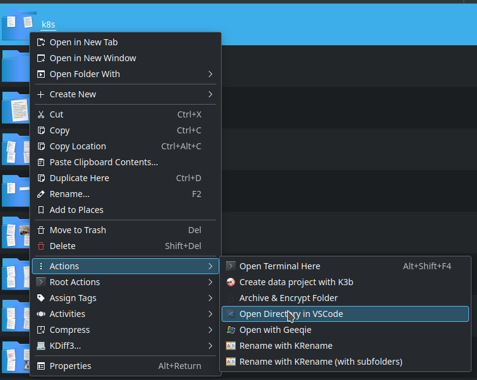

[Dolphin custom service menus](https://develop.kde.org/docs/extend/dolphin/service-menus/)

You can do that by adding a file with a name ending in ``.desktop`` in the location that the command `kf5-config --path services` gives you with the contents below:

```
/home/pablo/.local/share/kservices5/:/usr/share/kservices5/
```

```conf
[Desktop Entry]
Type=Service
X-KDE-ServiceTypes=KonqPopupMenu/Plugin
MimeType=inode/directory;
Actions=openInVsCode

[Desktop Action openInVsCode]
Name=Open Directory in VSCode
Icon=com.visualstudio.code
Exec=code --open-url %u
```



Note that inside the ``/usr/share/kservices5/`` folder there are more examples that can be taken as reference.
